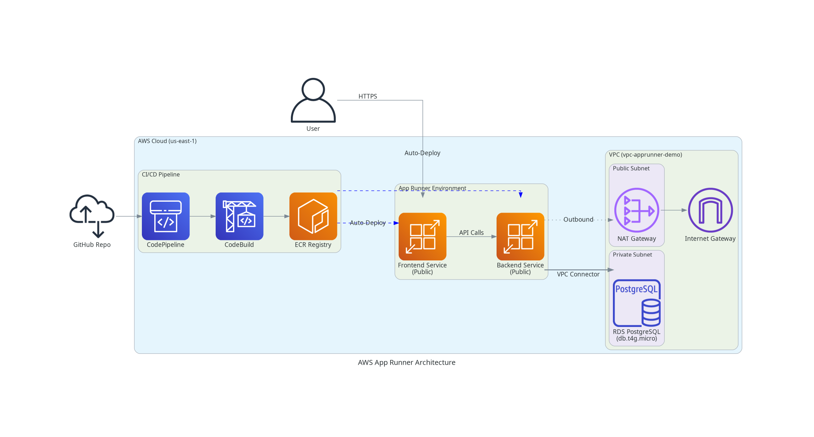

# AWS App Runner Deployment Guide


Deployment of the Tenant Management System using AWS App Runner.

**Deployed URLs:**
- **Frontend**: [https://pj7xmzndyv.us-east-1.awsapprunner.com](https://pj7xmzndyv.us-east-1.awsapprunner.com)
- **Backend**: [https://mdpd22d3t9.us-east-1.awsapprunner.com](https://mdpd22d3t9.us-east-1.awsapprunner.com)

## Architecture



We use AWS App Runner for a fully managed container deployment, connected to a private RDS PostgreSQL database via a VPC Connector.

### Network Flow
1.  **User Access**: Users access the Frontend via the public App Runner URL (HTTPS/443).
2.  **Frontend-to-Backend**: The Frontend container (React/Nginx) proxies API requests (`/api/...`) to the Backend App Runner service's public endpoint.
3.  **Backend-to-Database**: The Backend service connects to the RDS instance in the Private Subnet. Traffic flows through the **App Runner VPC Connector**, ensuring secure internal access.
4.  **Outbound Access**: The Backend accesses external APIs (e.g., Gemini AI) via the VPC Connector -> NAT Gateway -> Internet Gateway.

### Components
1.  **VPC (`apprunner-demo-vpc`)**:
    -   **Public Subnets**: For NAT Gateway and outbound traffic.
    -   **Private Subnets**: Hosts the RDS Database.
    -   **VPC Connector**: Bridges App Runner service to the Private Subnets.
2.  **App Runner Services**:
    -   **Backend**: Spring Boot container. Configured with private access to RDS.
    -   **Frontend**: React container. Talks to Backend via public URL (or internal if configured).
3.  **Database**: Amazon RDS PostgreSQL (`db.t4g.micro`) in private subnet.
4.  **CI/CD**: AWS CodePipeline + CodeBuild.
    -   Source: GitHub (`feature/aws-apprunner-deployment`).
    -   Build: CodeBuild creates Docker images -> Pushes to ECR.
    -   Deploy: App Runner **Auto-Deploy** triggers on new ECR image push.

## Deployment Instructions

### 1. Prerequisites
-   **GitHub Connection**: You must approve the "AWS Connector for GitHub" in the AWS Developer Tools Console -> Settings -> Connections.
-   **Secrets**: Update `terraform.tfvars` (not in git) with `db_password` and `gemini_api_key`.

### 2. Infrastructure Provisioning
Run Terraform to create all resources:
```bash
cd infrastructure/terraform-apprunner
terraform init
terraform apply
```

### 3. Pipeline & Deployment
Once Terraform finishes:
1.  Navigate to **AWS CodePipeline** console.
2.  The pipeline `pipeline-apprunner-demo` should start automatically.
3.  **App Runner** services will initially be in "Create" state, then transition to "Running" once the first image is pushed by the pipeline.

### 4. Accessing the Application
-   Go to the AWS App Runner Console.
-   Find the **Frontend Service** (`apprunner-demo-frontend`).
-   Click the **Default Domain** URL (e.g., `https://xyz.us-east-1.awsapprunner.com`).

## Verification
1.  **Logs**: View application logs directly in the App Runner Console -> "Logs" tab.
2.  **Database**: The backend connects to RDS at `jdbc:postgresql://<rds-endpoint>:5432/tenant_db`.

## Cleanup
To destroy resources and stop billing:
```bash
terraform destroy
```
*Note: App Runner creates resources that charge while "Running". You can also "Pause" services in the console to save costs without destroying infrastructure.*
