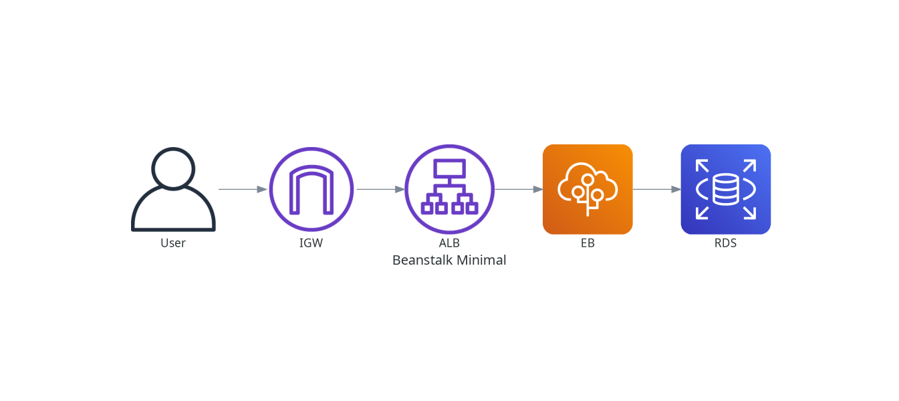

# AWS Elastic Beanstalk Deployment Guide

Deployment of the Tenant Management System using AWS Elastic Beanstalk (Docker Platform).

**Deployed URL:**
- **Application**: [http://beanstalk-env.eba-bbgvurme.us-east-1.elasticbeanstalk.com](http://beanstalk-env.eba-bbgvurme.us-east-1.elasticbeanstalk.com)

## Architecture



We use AWS Elastic Beanstalk Running Docker on Amazon Linux 2023 to orchestrate the backend and frontend containers, connected to a private RDS PostgreSQL database.

### Network Flow
1.  **User Access**: Users access the Application via the Elastic Beanstalk Load Balancer (ALB).
2.  **Load Balancer to Instance**: The ALB distributes traffic to the Docker instances in Public Subnets (or Private if configured, currently Public for simplicity in demo).
3.  **Container Routing**: The instance runs Nginx (or Docker Proxy) mapping external port 80 to the containers.
    -   Frontend listens on port `3000`.
    -   Backend listens on port `8080`.
4.  **Backend-to-Database**: The Backend container connects to the RDS instance in the Private Subnet. Traffic runs securely within the VPC.
5.  **Outbound Access**: The containers access external APIs (e.g., Gemini AI) via the NAT Gateway.

### Components
1.  **VPC (`beanstalk-env-vpc`)**:
    -   **Public Subnets**: Hosts NAT Gateway and Beanstalk Load Balancer.
    -   **Private Subnets**: Hosts RDS Database and (optionally) Beanstalk Instances.
2.  **Elastic Beanstalk Environment (`beanstalk-env`)**:
    -   **Platform**: Docker on Amazon Linux 2023.
    -   **Orchestration**: `docker-compose.yml` defines the multi-container setup.
    -   **Auto Scaling**: Automatically provisions and manages EC2 instances.
3.  **Database**: Amazon RDS PostgreSQL (`db.t4g.micro`) in private subnet.
4.  **CI/CD**: AWS CodePipeline + CodeBuild.
    -   Source: GitHub (`feature/aws-beanstalk-deployment`).
    -   Build: CodeBuild Creates Docker images -> Pushes to ECR -> Generates `docker-compose.yml`.
    -   Deploy: CodePipeline passes the `docker-compose.yml` to Elastic Beanstalk for deployment.

## Deployment Instructions

### 1. Prerequisites
-   **GitHub Connection**: Connection ARN configured in Terraform variables.
-   **Secrets**: Update `terraform.tfvars` with `db_password` and `gemini_api_key`.

### 2. Infrastructure Provisioning
Run Terraform to create all resources:
```bash
cd infrastructure/terraform-beanstalk
terraform init
terraform apply
```

### 3. Pipeline & Deployment
Once Terraform finishes:
1.  Navigate to **AWS CodePipeline** console.
2.  The pipeline `pipeline-beanstalk-env` will start automatically.
3.  Use the Beanstalk Console to monitor environment health ("Green").

### 4. Accessing the Application
-   Visit the URL: [http://beanstalk-env.eba-bbgvurme.us-east-1.elasticbeanstalk.com](http://beanstalk-env.eba-bbgvurme.us-east-1.elasticbeanstalk.com)

## Verification
1.  **Logs**: View application logs via Beanstalk Console -> Logs -> Request Last 100 Lines.
2.  **Database**: Backend connects via `jdbc:postgresql://<rds-endpoint>:5432/tenant_db`.

## Cleanup
To destroy resources:
```bash
terraform destroy
```
