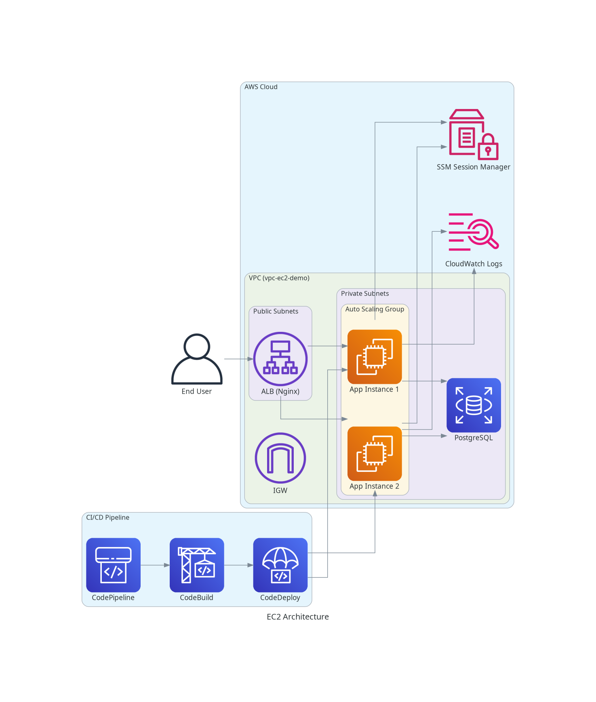

# AWS EC2 Deployment Guide

This guide details the architecture, deployment process, and management of the Tenant Management System on AWS EC2.

## Deployment Architecture

The application is deployed on EC2 instances running Amazon Linux 2023, managed by an Auto Scaling Group for high availability.



### Key Components
1.  **VPC (`vpc-ec2-demo`)**:
    *   **Public Subnets**: Host the Application Load Balancer (ALB) and NAT Gateway.
    *   **Private Subnets**: Host the EC2 instances and RDS Database (isolated from direct internet access).
2.  **Compute**:
    *   **Auto Scaling Group (ASG)**: Manages `t3.micro` instances (Min: 1, Max: 2).
    *   **Launch Template**: Defines the instance config (IAM Role, Security Groups, User Data).
    *   **Nginx**: Runs on port 80 as a reverse proxy (Frontend -> `/var/www/html`, Backend -> `localhost:8080`).
3.  **Database**:
    *   **RDS PostgreSQL**: Managed database in private subnets.
4.  **Security**:
    *   **ALB SG**: Allows Port 80/443 from Anywhere.
    *   **App SG**: Allows Port 80 from ALB only.
    *   **DB SG**: Allows Port 5432 from App SG only.

---

## Infrastructure Management (Terraform)

All infrastructure is defined as code in `infrastructure/terraform-ec2`.

### Prerequisites
*   AWS CLI configured (`aws configure`).
*   Terraform installed (`terraform -v`).

### 1. Initialize
```bash
cd infrastructure/terraform-ec2
terraform init
```

### 2. Plan & Apply
To create or update infrastructure:
```bash
terraform apply
# Type 'yes' to confirm
```

### 3. Destroy (Teardown)
To remove all resources and stop billing:
```bash
terraform destroy
# Type 'yes' to confirm
```

> **Note**: This will delete the RDS database and all data.

---

## CI/CD Pipeline

Deployments are fully automated via AWS CodePipeline (`pipeline-ec2-demo`).

### Workflow
1.  **Source**: GitHub (`feature/aws-ec2-deployment` branch).
2.  **Build (CodeBuild)**:
    *   Compiles Java Backend (Maven).
    *   Builds React Frontend (NPM).
    *   Packages artifacts with `appspec.yml` and `scripts/`.
3.  **Deploy (CodeDeploy)**:
    *   Unzips artifact to EC2 instances.
    *   Runs `scripts/stop_server.sh`.
    *   Updates files.
    *   Runs `scripts/start_server.sh` (Starts Java + Reloads Nginx).
    *   Runs `scripts/validate_service.sh` (Health Check).

### Triggering a Deploy
*   **Automatic**: Push to the `feature/aws-ec2-deployment` branch.
*   **Manual**: Go to AWS Console > CodePipeline > `pipeline-ec2-demo` > **Release Change**.

---

## Monitoring & Logs

### 1. CloudWatch Logs (Recommended)
Logs are streamed to AWS CloudWatch.
*   **Log Groups**:
    *   `ec2-app-logs-ec2-demo` (Application Logs)
    *   `ec2-nginx-access-ec2-demo` (Nginx Access)
    *   `ec2-nginx-error-ec2-demo` (Nginx Error)

### 2. SSM Session Manager (Live Debugging)
You can shell into instances without SSH keys.
1.  Go to **EC2 Console**.
2.  Select an instance.
3.  Click **Connect** -> **Session Manager** -> **Connect**.
4.  **Check Logs Manually**:
    ```bash
    tail -f /home/ec2-user/app/app.log
    tail -f /var/log/nginx/error.log
    ```

---

## Troubleshooting

### Deployment Fails at `AllowTraffic`
*   **Cause**: ALB Health Checks are failing.
*   **Fix**: Check Security Groups. Ensure `app_sg` allows traffic on Port 80 (Nginx) from `alb_sg`.

### Deployment Fails at `ValidateService`
*   **Cause**: Application took too long to start.
*   **Fix**: The `validate_service.sh` script retries for 5 minutes. If it still fails, check `app.log` for valid DB credentials.

### Application Returns 502 Bad Gateway
*   **Cause**: Nginx is running, but Java Backend is down.
*   **Fix**: Check `app.log`. Ensure `SPRING_PROFILES_ACTIVE=prod` and DB connection is successful.
