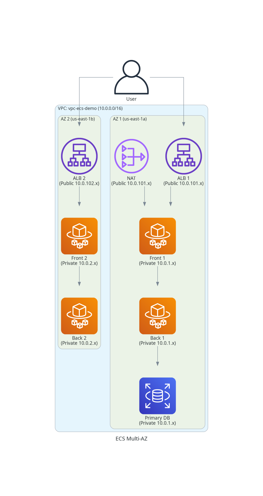

# AWS ECS Fargate Deployment Guide

This document serves as a comprehensive guide to the **Tenant Management System** deployment on AWS using **ECS Fargate**. It covers the architecture, the CI/CD pipeline, cost estimates, and how to manage the environment (destroy/recreate).

## 1. Architecture Overview

We have deployed the application using a **Microservices-ready** architecture on AWS.

### Components
*   **Virtual Private Cloud (VPC)**: An isolated network `vpc-ecs-demo` (10.0.0.0/16) ensuring security.
    *   **Public Subnets**: Host the **Application Load Balancer (ALB)** and **NAT Gateways**.
    *   **Private Subnets**: Host the **Application Containers (ECS)** and **Database (RDS)**. This ensures your data and apps are *never* directly exposed to the internet.
*   **ECS Fargate**: A "Serverless" container engine. We don't manage servers (EC2); we just tell AWS "Run this Docker container," and it handles the rest.
*   **Application Load Balancer (ALB)**: The entry point. It receives traffic from the internet and distributes it to your backend and frontend containers.
*   **Amazon RDS**: Managed PostgreSQL 16 database. It handles backups, patching, and scaling automatically.

### Architecture Diagram


---

## 2. CI/CD Pipeline (Automated Deployment)

We use **AWS CodePipeline** for fully automated deployments. You never deploy manually!

1.  **Source (GitHub)**: You push code to the `feature/aws-ecs-deployment` branch.
2.  **Build (CodeBuild)**:
    *   AWS spins up a temporary builder.
    *   It runs `docker build` for both Frontend and Backend.
    *   It pushes the new images to **Amazon ECR** (Elastic Container Registry).
3.  **Deploy (ECS)**:
    *   CodePipeline tells ECS: "There is a new image version."
    *   ECS starts new containers with the new code.
    *   ECS drains connections from old containers and stops them (Rolling Update).

---

## 3. Lifecycle Management (Cleanup & Recreation)

Since we use **Terraform** (Infrastructure as Code), you can save money by destroying the environment when not in use.

### 🔥 Cleanup (Destroy)
**Cost:** $0/hour after completion.

run this command in `infrastructure/terraform-ecs` folder:

```bash
terraform destroy
# Type 'yes' when prompted
```
*   **What happens**: Deletes VPC, Database, Load Balancers, and Pipelines.
*   **Note**: All database data will be lost (unless you manually snapshot).

### 🚀 Recreation (Spin Up)
When you are ready to work again:

run this command in `infrastructure/terraform` folder:

```bash
terraform apply
# Type 'yes' when prompted
```

#### Crucial Post-Creation Step
The **GitHub Connection** resets when recreated. You must manually re-authorize it:
1.  Go to **AWS Console > Developer Tools > Settings > Connections**.
2.  Find `tenant-management-github-conn` (Status: Pending).
3.  Click **"Update Pending Connection"** -> Authorize GitHub.
4.  Go to **CodePipeline**, find `pipeline-ecs-demo`, and click **"Release Change"** to trigger the first build.

---

## 4. Cost Estimates (Approximate)

Running this architecture 24/7 in `us-east-1` costs approximately **$91.00 / month**.

| Component | Why do we need it? | Approx Cost |
| :--- | :--- | :--- |
| **NAT Gateway** | Allows private containers to download updates/images. | ~$33.00/mo |
| **Fargate (Compute)** | CPU/RAM for running your containers. | ~$27.00/mo |
| **Load Balancer** | Routes traffic and handles SSL (future). | ~$16.50/mo |
| **RDS (Database)** | Managed PostgreSQL instance. | ~$14.50/mo |

> **Tip**: Destroying the environment when learning/demoing is finished is the best way to save costs!

---

## 5. Why this Architecture?

*   **Security**: Bank-grade networking (Private Subnets).
*   **Scalability**: Fargate can scale from 1 to 1000 containers in seconds.
*   **Maintainability**: No OS patching (Fargate/RDS are managed).
*   **Automation**: Infrastructure as Code (Terraform) + CI/CD means reproducible, error-free deployments.
