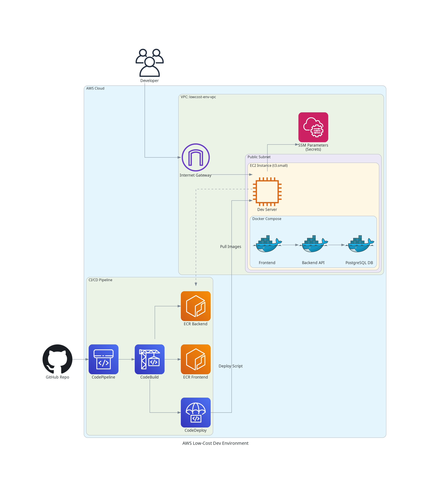

# AWS Low-Cost Development Environment Guide

## Overview
This approach provides a highly cost-effective development environment by consolidating all application components onto a **single EC2 Spot instance with multi-AZ support**. Instead of paying for managed services like RDS, ALB, or NAT Gateways, we run the database, backend, and frontend as containers orchestrated by Docker Compose on one `t3.small` server.

## Architecture



### Key Components
1.  **EC2 Spot Instance with Auto Scaling**: A `t3.small` (or `t3a.small`/`t2.small`) Spot instance hosts the entire stack.
    -   **Multi-AZ Deployment**: Spans 3 availability zones (us-east-1a, us-east-1b, us-east-1c) for better Spot availability
    -   **Auto Scaling Group**: Automatically replaces interrupted instances
    -   **Instance Diversification**: Can use t3.small, t3a.small, or t2.small for better availability
    -   Host OS: Ubuntu 24.04 LTS
    -   Runtime: Docker Engine + Docker Compose
2.  **Containerized Database**: PostgreSQL 16 runs as a Docker container, persisting data to a **shared EFS volume** mapping. This ensures data is available across all zones and eliminates the ~$15/month minimum cost of an RDS instance.
3.  **Public Subnet Access**: The instance sits in a Public Subnet across multiple AZs, accessible via **Instance Connect** or SSH. We rely on Security Groups (firewalls) restricted to our IP (or open ports 80/443 for web access) rather than expensive Load Balancers.
4.  **CI/CD**: Full automation via CodePipeline:
    -   **CodeBuild**: Builds Docker images and pushes to ECR.
    -   **CodeDeploy**: Triggers an on-instance script to pull new images and restart `docker-compose`.
    -   **SSM Parameter Store**: Securely stores secrets (DB Password, API Keys) which are injected at runtime.

## Cost Analysis (Estimated)

| Component | Specification | Approx. Monthly Cost (Region: us-east-1) |
| :--- | :--- | :--- |
| **Compute** | EC2 `t3.small` Spot (2 vCPU, 2GB RAM) | ~$3.50 - $5.00 (70-80% savings) |
| **Storage (EFS)** | EFS for PostgreSQL data (~1-2GB) | ~$0.30 - $0.60 |
| **Storage (EBS)** | Root volume (8GB) | ~$0.64 |
| **Database** | Self-Hosted in Docker on EFS | **$0.00** (Included in EFS) |
| **Network** | Public IPv4 Address | ~$3.60 ($0.005/hr) |
| **Logs** | CloudWatch Logs (5GB/month) | ~$2.50 - $3.00 |
| **CI/CD** | CodePipeline (1 Active) | ~$1.00 (Often Free Tier eligible) |
| **Registry** | ECR (Storage + Transfer) | ~$0.50 (Based on usage) |
| **Total** | | **~$12.00 - $15.00 / Month** |

*Comparison*: 
- **Standard setup** with Managed RDS, App Runner, and NAT Gateway: **$100+/month**
- **On-Demand EC2 setup**: **~$22.50/month**
- **This Spot + EFS setup**: **~$12-15/month** (40% cheaper than On-Demand, 85% cheaper than standard)

**Spot Instance Benefits**:
- 60-80% cost savings compared to On-Demand
- Multi-AZ deployment reduces interruption impact
- Auto Scaling Group automatically replaces interrupted instances
- `price-capacity-optimized` strategy minimizes interruptions

**Data Persistence**:
- PostgreSQL data stored on a **Regional EFS** (survives instance replacements and AZ swaps)
- Logs sent to CloudWatch (7-day retention)
- Application code redeployed automatically via CodeDeploy

## Deployment Instructions

### 1. Prerequisites
-   **GitHub Connection**: Ensure the AWS Connector for GitHub is active.
-   **Secrets**: Update `terraform.tfvars` with:
    -   `db_password`: Secure password for the containerized DB.
    -   `gemini_api_key`: Your AI service key.

### 2. Infrastructure
Provision the environment using Terraform:
```bash
cd infrastructure/terraform-lowcost
terraform init
terraform apply
```

### 3. CI/CD Flow
1.  **Push to Git**: Changes to `feature/aws-lowcost-deployment` trigger the pipeline.
2.  **Build**: CodeBuild creates images for Backend and Frontend.
3.  **Deploy**: CodeDeploy notifies the EC2 instance.
    -   The `start_server.sh` script runs on the instance.
    -   It fetches secrets from SSM.
    -   It pulls the latest images from ECR.
    -   It restarts `docker compose up -d`.

### 4. Verification
1.  **Find Instance IP**: Get the public IP of the `lowcost-env-app-server` from the AWS Console.
2.  **Access App**:
    -   Frontend: `http://<EC2-PUBLIC-IP>:3000` (Port 80 mapped to 3000)
    -   Backend API: `http://<EC2-PUBLIC-IP>:8080/api/...`
3.  **Check Logs**: SSH into the instance to inspect container logs:
    ```bash
    docker logs tenant-backend
    docker logs tenant-db
    ```

## Trade-offs
-   **Spot Interruptions**: Spot instances can be interrupted when AWS needs capacity back. However:
    -   Multi-AZ deployment across 3 zones significantly reduces interruption frequency
    -   Auto Scaling Group automatically launches replacement instances
    -   Instance diversification (t3.small, t3a.small, t2.small) improves availability
    -   Typical interruption rate: 5-10% (varies by region/AZ)
-   **Data Durability**: Data is persisted to **EFS**, which is a regional service. Data survives instance replacements and availability zone changes. **Recommendation**: While EFS is highly durable, you should still consider periodic backups of critical database state.
-   **Scaling**: Manual vertical scaling (resize instance type in ASG) only. No horizontal auto-scaling.
-   **Maintenance**: OS updates and Docker management are user responsibilities.
-   **Brief Downtime**: When Spot instance is interrupted, there will be 2-5 minutes of downtime while ASG launches replacement.

This environment is **ideal for development, testing, and demos**, but **not recommended for production** without:
- Automated EBS snapshots
- Database backup strategy
- Monitoring and alerting for interruptions
- Consider Reserved Instances or Savings Plans for production workloads
