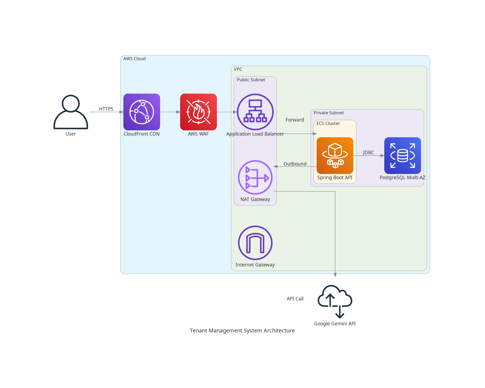

# Architecture Diagram

This document outlines the architecture of the Tenant Management System, mapped to a hypothetical AWS deployment.

## System Components

- **Frontend**: React application, served via S3 and CloudFront (or AWS Amplify).
- **Backend**: Spring Boot application, running on ECS (Fargate) or EC2.
- **Database**: PostgreSQL, hosted on Amazon RDS.
- **AI Integration**: Google Gemini API (External Service).

## Architecture Diagram



## Mermaid Diagram (Reference)

```mermaid
flowchart TD
    subgraph Client
        Browser["User Browser"]
    end

    subgraph AWS_Cloud["AWS Cloud"]
        style AWS_Cloud fill:#f9f9f9,stroke:#232f3e,stroke-width:2px
        
        subgraph VPC["VPC"]
            style VPC fill:#ffffff,stroke:#8c4b00,stroke-dasharray: 5 5
            
            subgraph Public_Subnet["Public Subnet"]
                style Public_Subnet fill:#f0f7ff,stroke:#0073bb
                
                ALB["Application Load Balancer"]
                style ALB fill:#d9ebff,stroke:#0073bb
                
                Frontend["S3 / CloudFront <br/> (React Frontend)"]
                style Frontend fill:#d9ebff,stroke:#0073bb
            end
            
            subgraph Private_Subnet["Private Subnet"]
                style Private_Subnet fill:#f0f7ff,stroke:#0073bb
                
                Backend["ECS Fargate / EC2 <br/> (Spring Boot API)"]
                style Backend fill:#d9ebff,stroke:#0073bb
                
                DB[("RDS PostgreSQL <br/> (Tenant DB)")]
                style DB fill:#d9ebff,stroke:#3b48cc
            end
        end
    end
    
    subgraph External_Services["External Services"]
        Gemini["Google Gemini API"]
        style Gemini fill:#e6f7ff,stroke:#333
    end

    Browser -->|HTTPS / Static Assets| Frontend
    Browser -->|API Requests (HTTPS)| ALB
    ALB -->|Forward Requests| Backend
    Backend -->|JDBC Connection| DB
    Backend -->|AI Inference| Gemini

    linkStyle 0,1,2,3,4 stroke:#333,stroke-width:2px;
```

## Data Flow

1.  **User Access**: The user accesses the application via their browser. Static assets (React app) are served from S3/CloudFront.
2.  **API Requests**: API requests from the frontend are sent to the Application Load Balancer (ALB).
3.  **Backend Processing**: The ALB forwards requests to the Spring Boot backend running on ECS Fargate or EC2 instances in a private subnet.
4.  **Database Interaction**: The backend communicates with the RDS PostgreSQL database for persistent storage.
5.  **AI Integration**: The backend makes external calls to the Google Gemini API for AI-powered features.
