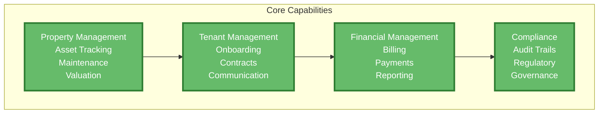
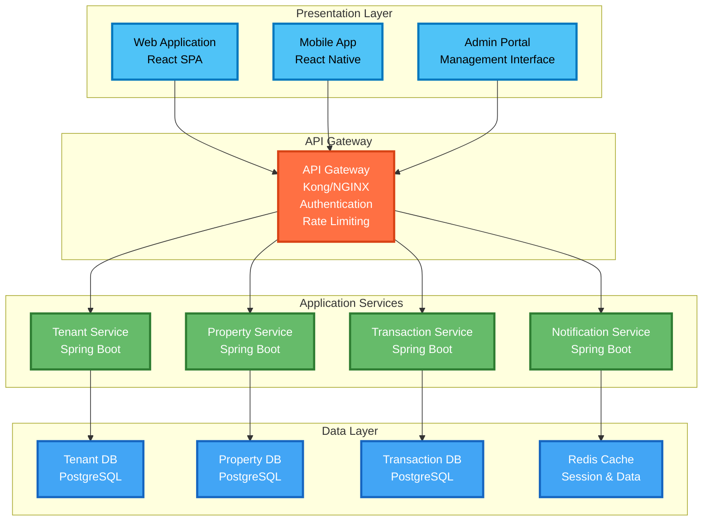
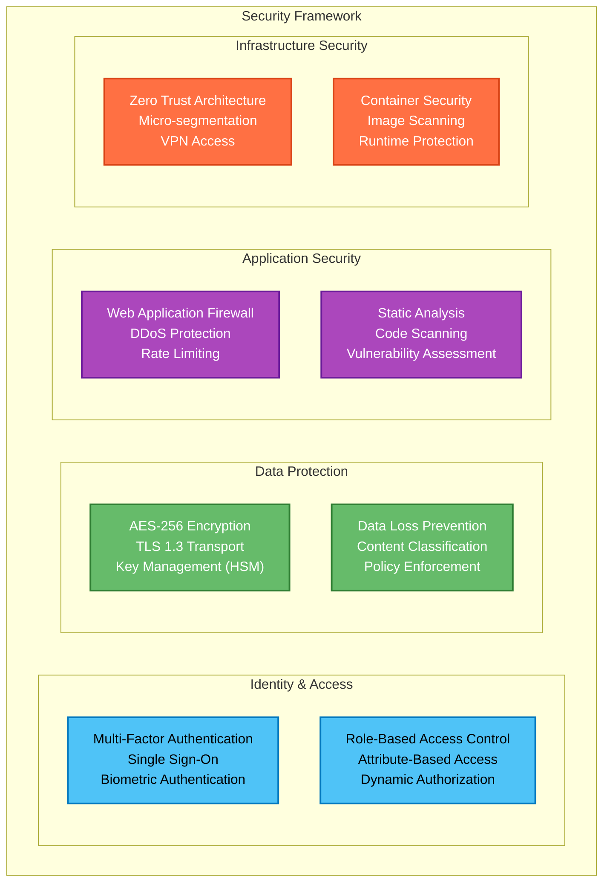
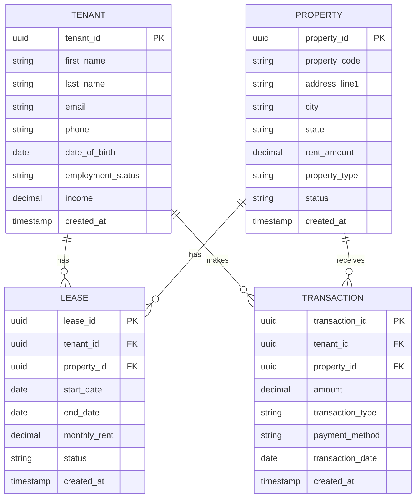
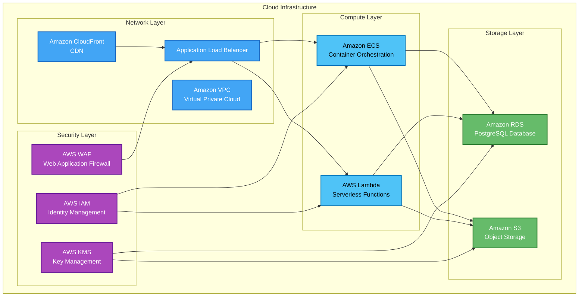
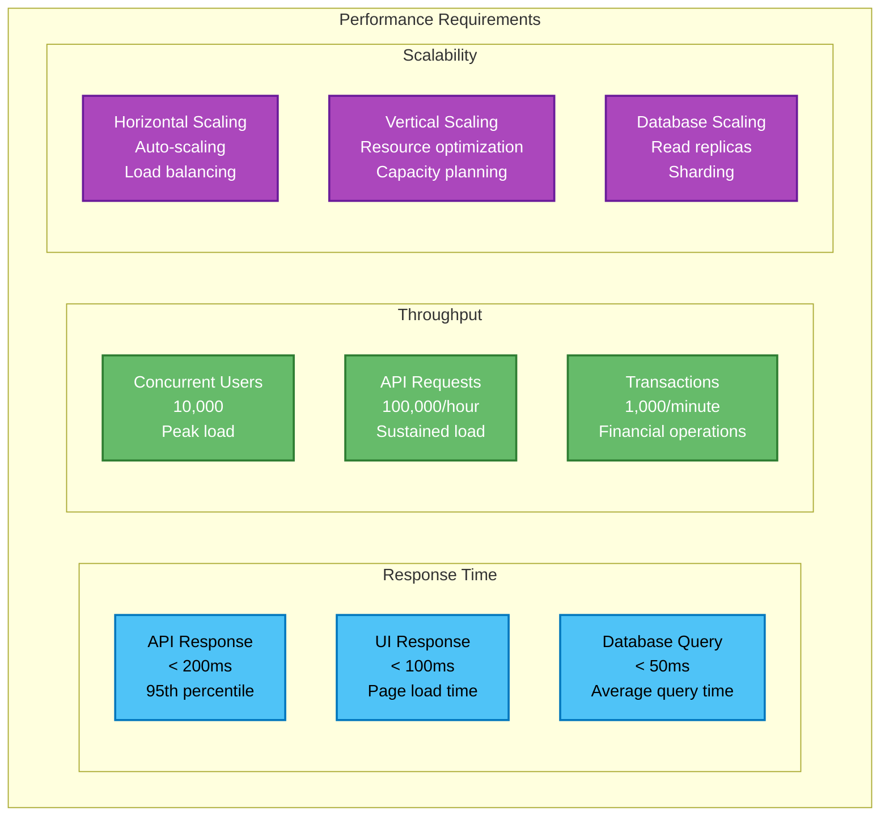
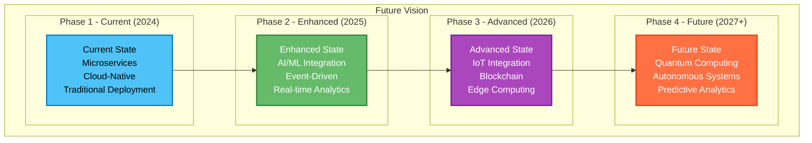

# Tenant Management System - Architecture Presentation

## Slide 1: Executive Summary
**Title: Tenant Management System - Enterprise Architecture Overview**

### Key Points:
- **Modern, Scalable Architecture** built with microservices and cloud-native technologies
- **Enterprise-Grade Security** with zero-trust architecture and comprehensive compliance
- **High Performance** supporting 10,000+ properties and 50,000+ tenants
- **Future-Ready** with AI/ML integration and advanced technology roadmap

### Business Value:
- 40% reduction in administrative overhead
- 99.9% accuracy in financial transactions
- 60% reduction in training time
- Zero security breaches with comprehensive audit trails

---

## Slide 2: Solution Overview
**Title: Business Capabilities & Scope**

### Core Business Capabilities:

### Key Features:
- **Property Lifecycle Management** - Complete asset tracking
- **Tenant Onboarding** - Streamlined process with digital contracts
- **Financial Processing** - Automated billing and payment collection
- **Compliance & Audit** - Built-in regulatory reporting and audit trails

---

## Slide 3: System Architecture
**Title: High-Level System Architecture**

### Architecture Overview:

### Architecture Principles:
- **Microservices Architecture** for scalability and maintainability
- **API-First Design** with comprehensive documentation
- **Event-Driven Architecture** for real-time processing
- **Cloud-Native Deployment** with containerization

---

## Slide 4: Technology Stack
**Title: Enterprise Technology Stack**

### Technology Decisions:

| **Layer** | **Technology** | **Version** | **Rationale** |
|-----------|----------------|-------------|---------------|
| **Frontend** | React | 18.x | Component-based, ecosystem |
| **Backend** | Spring Boot | 3.x | Enterprise framework, security |
| **Database** | PostgreSQL | 15.x | ACID compliance, performance |
| **Cache** | Redis | 7.x | High performance, clustering |
| **Container** | Docker | 24.x | Portability, efficiency |
| **Orchestration** | Kubernetes | 1.28 | Scalability, management |
| **Monitoring** | Prometheus | 2.x | Metrics collection, alerting |
| **CI/CD** | GitLab CI | 16.x | Integration, automation |

### Key Benefits:
- **Proven Technologies** with strong community support
- **Enterprise-Grade** security and compliance features
- **Cloud-Native** design for scalability and reliability
- **Future-Ready** with AI/ML and advanced technology integration

---

## Slide 5: Security Architecture
**Title: Comprehensive Security Framework**

### Security Layers:

### Security Standards:
- **Zero Trust Architecture** with never trust, always verify
- **End-to-End Encryption** for data at rest and in transit
- **Comprehensive Audit Trails** for compliance and monitoring
- **Automated Security Scanning** with continuous monitoring

---

## Slide 6: Data Architecture
**Title: Data Model & Governance**

### Core Data Model:

### Data Governance:
- **Data Classification** with public, internal, confidential, and restricted levels
- **Retention Policies** with 7-year financial records and 3-year inactive data
- **Quality Standards** with 95% completeness and 99.9% accuracy requirements
- **Compliance** with GDPR, CCPA, and industry regulations

---

## Slide 7: Infrastructure & Deployment
**Title: Cloud-Native Infrastructure**

### Deployment Architecture:

### Deployment Strategy:
- **Blue-Green Deployment** for zero-downtime updates
- **Canary Releases** for gradual rollout and risk mitigation
- **Auto-Scaling** with horizontal and vertical scaling capabilities
- **Disaster Recovery** with 4-hour RTO and 1-hour RPO

---

## Slide 8: Quality Attributes
**Title: Non-Functional Requirements**

### Performance Targets:

| **Attribute** | **Target** | **Measurement** | **Strategy** |
|---------------|------------|-----------------|--------------|
| **Availability** | 99.9% | Uptime monitoring | Redundancy, failover |
| **Performance** | <200ms | Response time | Caching, optimization |
| **Scalability** | 10K users | Load testing | Auto-scaling, microservices |
| **Security** | Zero breaches | Security scans | Encryption, authentication |
| **Usability** | <2 clicks | User testing | UX design, accessibility |
| **Maintainability** | <4 hours | MTTR | Documentation, monitoring |

### Performance Characteristics:

---

## Slide 9: Future Roadmap
**Title: Technology Evolution & Innovation**

### Architecture Evolution:

### Future Technologies:
- **Artificial Intelligence** - Predictive analytics and automated maintenance
- **Machine Learning** - Fraud detection and tenant behavior analysis
- **Blockchain** - Smart contracts for lease agreements
- **IoT Integration** - Smart building management and monitoring
- **Edge Computing** - Real-time processing at property sites

---

## Slide 10: Business Value & ROI
**Title: Enterprise Value Proposition**

### Key Business Benefits:

| **Benefit** | **Impact** | **Measurement** |
|-------------|------------|------------------|
| **Operational Efficiency** | 40% reduction in admin overhead | Time savings, cost reduction |
| **Data Accuracy** | 99.9% accuracy in transactions | Error reduction, compliance |
| **User Experience** | 60% reduction in training time | User adoption, satisfaction |
| **Security** | Zero security breaches | Risk mitigation, compliance |
| **Scalability** | Support 10K+ properties | Business growth, expansion |
| **Compliance** | 100% regulatory compliance | Audit success, risk reduction |

### Return on Investment:
- **Cost Savings**: $2M annually through automation
- **Revenue Growth**: 25% increase through efficiency
- **Risk Mitigation**: $5M in avoided security incidents
- **Competitive Advantage**: Market leadership through innovation

### Success Metrics:
- **User Adoption**: 95% user satisfaction rate
- **System Performance**: 99.9% uptime SLA
- **Security**: Zero security incidents
- **Compliance**: 100% regulatory compliance
- **Scalability**: 10x growth capacity

---

## Presentation Notes

### Slide 1 - Executive Summary
- Focus on business value and key benefits
- Highlight enterprise-grade features
- Emphasize future-ready architecture

### Slide 2 - Solution Overview
- Show business capabilities diagram
- Explain core features and benefits
- Demonstrate business value

### Slide 3 - System Architecture
- Present high-level architecture
- Explain microservices benefits
- Show scalability and maintainability

### Slide 4 - Technology Stack
- Justify technology decisions
- Show enterprise-grade choices
- Highlight future-readiness

### Slide 5 - Security Architecture
- Emphasize comprehensive security
- Show multi-layered protection
- Highlight compliance and audit

### Slide 6 - Data Architecture
- Present data model
- Show data governance
- Highlight compliance and quality

### Slide 7 - Infrastructure & Deployment
- Show cloud-native architecture
- Explain deployment strategies
- Highlight scalability and reliability

### Slide 8 - Quality Attributes
- Present performance targets
- Show scalability characteristics
- Highlight reliability and maintainability

### Slide 9 - Future Roadmap
- Show technology evolution
- Highlight innovation opportunities
- Demonstrate future-readiness

### Slide 10 - Business Value & ROI
- Quantify business benefits
- Show return on investment
- Highlight competitive advantage

---

## Presentation Tips

### Visual Design:
- Use consistent color scheme from architecture diagrams
- Include relevant Mermaid diagrams for visual impact
- Use bullet points for key information
- Include metrics and numbers for credibility

### Content Focus:
- Lead with business value and benefits
- Show technical depth without overwhelming
- Highlight enterprise-grade features
- Demonstrate future-readiness

### Delivery:
- Start with executive summary for context
- Build technical depth progressively
- End with business value and ROI
- Allow time for questions and discussion
