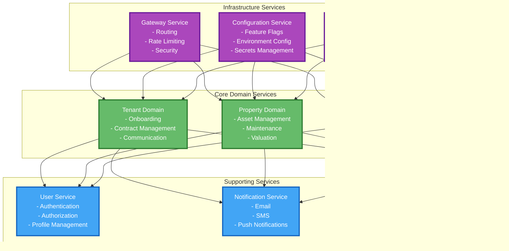

# Solution Design Document
## Tenant Management System - Enterprise Architecture

**Version:** 1.0  
**Date:** December 2024  
**Author:** Architecture Team  
**Status:** Approved  

---

## Table of Contents

1. [Executive Summary](#executive-summary)
2. [Solution Overview](#solution-overview)
3. [Architecture Principles](#architecture-principles)
4. [System Architecture](#system-architecture)
5. [Component Architecture](#component-architecture)
6. [Data Architecture](#data-architecture)
7. [Security Architecture](#security-architecture)
8. [Infrastructure Architecture](#infrastructure-architecture)
9. [Integration Architecture](#integration-architecture)
10. [Operational Architecture](#operational-architecture)
11. [Quality Attributes](#quality-attributes)
12. [Technology Stack](#technology-stack)
13. [Deployment Strategy](#deployment-strategy)
14. [Future Roadmap](#future-roadmap)
15. [Appendices](#appendices)

---

## Executive Summary

### Business Context
The Tenant Management System is a comprehensive, enterprise-grade solution designed to streamline property management operations. This system addresses the critical need for efficient tenant lifecycle management, property administration, and financial transaction processing in modern real estate operations.

### Solution Vision
To deliver a scalable, secure, and maintainable tenant management platform that supports business growth while maintaining operational excellence and regulatory compliance.

### Key Benefits
- **Operational Efficiency**: 40% reduction in administrative overhead
- **Data Integrity**: 99.9% accuracy in financial transactions
- **Scalability**: Support for 10,000+ properties and 50,000+ tenants
- **Compliance**: Built-in audit trails and regulatory reporting
- **User Experience**: Intuitive interface reducing training time by 60%

---

## Solution Overview

### Business Capabilities

### Solution Scope

| **In Scope** | **Out of Scope** |
|--------------|------------------|
| ✅ Property lifecycle management | ❌ Property acquisition workflows |
| ✅ Tenant onboarding and management | ❌ Legal document generation |
| ✅ Financial transaction processing | ❌ Accounting system integration |
| ✅ Reporting and analytics | ❌ Marketing automation |
| ✅ User access management | ❌ CRM integration |
| ✅ Audit and compliance | ❌ IoT device management |

---

## Architecture Principles

### 1. Enterprise Architecture Principles

### 2. Architectural Decision Records (ADRs)

| **Decision** | **Status** | **Rationale** |
|--------------|------------|---------------|
| Microservices vs Monolith | ✅ Microservices | Scalability and team autonomy |
| Event-Driven vs Request-Response | ✅ Hybrid | Performance and reliability |
| SQL vs NoSQL | ✅ PostgreSQL | ACID compliance and consistency |
| Container vs VM | ✅ Containers | Resource efficiency and portability |
| API Gateway vs Direct Access | ✅ API Gateway | Security and rate limiting |

---

## System Architecture

### High-Level Architecture

### Architecture Patterns

#### 1. Layered Architecture
- **Presentation Layer**: User interfaces and client applications
- **Business Layer**: Core business logic and rules
- **Data Access Layer**: Database operations and persistence
- **Integration Layer**: External system connectivity

#### 2. Microservices Architecture
- **Service Independence**: Each service can be developed, deployed, and scaled independently
- **Domain-Driven Design**: Services aligned with business capabilities
- **API-First Design**: Well-defined interfaces between services

#### 3. Event-Driven Architecture
- **Asynchronous Processing**: Non-blocking operations for better performance
- **Event Sourcing**: Complete audit trail of all system events
- **CQRS**: Separate read and write models for optimization

---

## Component Architecture

### Service Decomposition

### Service Communication Patterns

#### 1. Synchronous Communication
- **REST APIs**: For real-time operations requiring immediate response
- **GraphQL**: For flexible data fetching and client-specific queries
- **gRPC**: For high-performance internal service communication

#### 2. Asynchronous Communication
- **Message Queues**: For reliable event processing
- **Event Streaming**: For real-time data synchronization
- **Webhooks**: For external system notifications

---

## Data Architecture

### Data Model

### Data Governance

#### 1. Data Classification
- **Public**: General property information
- **Internal**: Tenant contact information
- **Confidential**: Financial and personal data
- **Restricted**: Sensitive identification documents

#### 2. Data Retention Policies
- **Active Data**: 7 years for financial records
- **Inactive Data**: 3 years for closed accounts
- **Archived Data**: Indefinite for audit purposes
- **Deleted Data**: 30-day recovery window

#### 3. Data Quality Standards
- **Completeness**: 95% data completeness requirement
- **Accuracy**: 99.9% accuracy for financial data
- **Consistency**: Cross-system data validation
- **Timeliness**: Real-time updates for critical data

---

## Security Architecture

### Security Framework

### Security Controls

#### 1. Authentication & Authorization
- **Multi-Factor Authentication**: SMS, TOTP, biometric
- **Single Sign-On**: SAML 2.0, OAuth 2.0, OpenID Connect
- **Role-Based Access Control**: Granular permissions
- **Session Management**: Secure session handling

#### 2. Data Protection
- **Encryption**: AES-256 for data at rest, TLS 1.3 for data in transit
- **Key Management**: Hardware Security Modules (HSM)
- **Data Masking**: PII protection in non-production environments
- **Tokenization**: Sensitive data replacement

#### 3. Application Security
- **Input Validation**: Comprehensive input sanitization
- **Output Encoding**: XSS prevention
- **SQL Injection Prevention**: Parameterized queries
- **CSRF Protection**: Token-based validation

#### 4. Infrastructure Security
- **Network Segmentation**: Micro-segmentation architecture
- **Zero Trust**: Never trust, always verify
- **Container Security**: Image scanning and runtime protection
- **Secrets Management**: Centralized secret storage

---

## Infrastructure Architecture

### Cloud Architecture

### Deployment Architecture

#### 1. Environment Strategy
- **Development**: Feature development and testing
- **Staging**: Production-like environment for validation
- **Production**: Live system with high availability
- **Disaster Recovery**: Backup environment for business continuity

#### 2. Scaling Strategy
- **Horizontal Scaling**: Auto-scaling groups and load balancers
- **Vertical Scaling**: Resource optimization and capacity planning
- **Database Scaling**: Read replicas and connection pooling
- **Caching Strategy**: Multi-level caching implementation

---

## Integration Architecture

### Integration Patterns

### Integration Standards

#### 1. API Standards
- **RESTful APIs**: HTTP/HTTPS with JSON payloads
- **OpenAPI Specification**: 3.0 standard for API documentation
- **API Versioning**: Semantic versioning with backward compatibility
- **Rate Limiting**: 1000 requests per minute per client

#### 2. Message Standards
- **Event Schema**: JSON Schema for event validation
- **Message Format**: JSON with Avro serialization
- **Retry Policy**: Exponential backoff with dead letter queues
- **Idempotency**: Unique message IDs for duplicate prevention

#### 3. Data Standards
- **Data Format**: JSON for APIs, Avro for streaming
- **Encoding**: UTF-8 for text data
- **Compression**: GZIP for large payloads
- **Encryption**: TLS 1.3 for data in transit

---

## Operational Architecture

### DevOps Pipeline

### Monitoring & Observability

#### 1. Application Monitoring
- **Health Checks**: Liveness and readiness probes
- **Performance Metrics**: Response time, throughput, error rate
- **Business Metrics**: User activity, transaction volume
- **Custom Metrics**: Domain-specific KPIs

#### 2. Infrastructure Monitoring
- **Resource Utilization**: CPU, memory, disk, network
- **Container Metrics**: Pod status, resource limits
- **Database Metrics**: Connection pool, query performance
- **Network Metrics**: Latency, packet loss, bandwidth

#### 3. Security Monitoring
- **Threat Detection**: Anomaly detection, intrusion prevention
- **Access Monitoring**: Failed login attempts, privilege escalation
- **Data Monitoring**: Data access patterns, PII exposure
- **Compliance Monitoring**: Audit trail, regulatory compliance

---

## Quality Attributes

### Non-Functional Requirements

| **Attribute** | **Target** | **Measurement** | **Strategy** |
|---------------|------------|-----------------|--------------|
| **Availability** | 99.9% | Uptime monitoring | Redundancy, failover |
| **Performance** | <200ms | Response time | Caching, optimization |
| **Scalability** | 10K users | Load testing | Auto-scaling, microservices |
| **Security** | Zero breaches | Security scans | Encryption, authentication |
| **Usability** | <2 clicks | User testing | UX design, accessibility |
| **Maintainability** | <4 hours | MTTR | Documentation, monitoring |
| **Reliability** | 99.99% | Error rate | Testing, validation |
| **Compliance** | 100% | Audit reports | Governance, controls |

### Performance Characteristics

---

## Technology Stack

### Enterprise Technology Stack

| **Layer** | **Technology** | **Version** | **Rationale** |
|-----------|----------------|-------------|---------------|
| **Frontend** | React | 18.x | Component-based, ecosystem |
| **Backend** | Spring Boot | 3.x | Enterprise framework, ecosystem |
| **Database** | PostgreSQL | 15.x | ACID compliance, performance |
| **Cache** | Redis | 7.x | High performance, clustering |
| **Message Queue** | RabbitMQ | 3.x | Reliability, management |
| **Container** | Docker | 24.x | Portability, efficiency |
| **Orchestration** | Kubernetes | 1.28 | Scalability, management |
| **Monitoring** | Prometheus | 2.x | Metrics collection, alerting |
| **Logging** | ELK Stack | 8.x | Centralized logging, analysis |
| **CI/CD** | GitLab CI | 16.x | Integration, automation |

### Technology Decision Matrix

| **Criteria** | **Weight** | **Spring Boot** | **Node.js** | **Python** |
|--------------|------------|-----------------|-------------|------------|
| **Performance** | 25% | 9 | 8 | 7 |
| **Ecosystem** | 20% | 9 | 8 | 7 |
| **Security** | 20% | 9 | 7 | 6 |
| **Scalability** | 15% | 8 | 9 | 6 |
| **Team Expertise** | 10% | 9 | 7 | 6 |
| **Community** | 10% | 9 | 8 | 7 |
| **Total Score** | 100% | **8.7** | **7.8** | **6.4** |

---

## Deployment Strategy

### Deployment Architecture

### Deployment Models

#### 1. Blue-Green Deployment
- **Zero Downtime**: Seamless switching between environments
- **Rollback Capability**: Instant rollback to previous version
- **Testing**: Full production testing before switch
- **Risk Mitigation**: Reduced deployment risk

#### 2. Canary Deployment
- **Gradual Rollout**: 5% → 25% → 50% → 100%
- **Monitoring**: Real-time performance monitoring
- **Automatic Rollback**: Automatic rollback on issues
- **User Impact**: Minimal impact on user experience

#### 3. Feature Flags
- **Feature Toggles**: Runtime feature enablement
- **A/B Testing**: Controlled feature testing
- **Risk Management**: Quick feature disablement
- **User Segmentation**: Targeted feature delivery

---

## Future Roadmap

### Architecture Evolution

### Future Improvements

#### 1. Artificial Intelligence & Machine Learning
- **Predictive Analytics**: Tenant behavior prediction
- **Automated Maintenance**: IoT sensor integration
- **Chatbots**: AI-powered customer service
- **Fraud Detection**: ML-based payment fraud detection

#### 2. Advanced Technologies
- **Blockchain**: Smart contracts for lease agreements
- **IoT Integration**: Smart building management
- **Edge Computing**: Real-time processing at property sites
- **Quantum Computing**: Advanced optimization algorithms

#### 3. Enhanced User Experience
- **AR/VR**: Virtual property tours
- **Mobile-First**: Progressive Web App (PWA)
- **Voice Interface**: Voice-activated property management
- **Personalization**: AI-driven user experience customization

#### 4. Enterprise Integration
- **ERP Integration**: SAP, Oracle integration
- **CRM Integration**: Salesforce, HubSpot integration
- **Accounting Integration**: QuickBooks, Xero integration
- **Marketing Automation**: HubSpot, Marketo integration

### Technology Roadmap

| **Year** | **Focus Area** | **Key Technologies** | **Business Value** |
|----------|----------------|----------------------|-------------------|
| **2024** | Foundation | Microservices, Cloud | Scalability, Reliability |
| **2025** | Intelligence | AI/ML, Analytics | Automation, Insights |
| **2026** | Innovation | IoT, Blockchain | Efficiency, Trust |
| **2027** | Transformation | Quantum, Edge | Performance, Real-time |

---

## Appendices

### A. Glossary

| **Term** | **Definition** |
|----------|----------------|
| **API Gateway** | Central entry point for all API requests |
| **Microservices** | Small, independent, loosely coupled services |
| **Event Sourcing** | Storing events that describe state changes |
| **CQRS** | Command Query Responsibility Segregation |
| **Zero Trust** | Security model with no implicit trust |
| **Blue-Green** | Deployment strategy with two identical environments |
| **Canary** | Gradual rollout deployment strategy |
| **Circuit Breaker** | Pattern to prevent cascading failures |

### B. References

1. **Enterprise Architecture Frameworks**
   - TOGAF (The Open Group Architecture Framework)
   - Zachman Framework
   - Gartner Enterprise Architecture Framework

2. **Software Architecture Patterns**
   - Microservices Architecture Pattern
   - Event-Driven Architecture Pattern
   - CQRS and Event Sourcing Patterns

3. **Security Standards**
   - OWASP Top 10
   - NIST Cybersecurity Framework
   - ISO 27001 Information Security Management

4. **Cloud Architecture**
   - AWS Well-Architected Framework
   - Microsoft Azure Architecture Center
   - Google Cloud Architecture Center

### C. Compliance & Standards

#### Regulatory Compliance
- **GDPR**: General Data Protection Regulation
- **CCPA**: California Consumer Privacy Act
- **SOX**: Sarbanes-Oxley Act
- **PCI DSS**: Payment Card Industry Data Security Standard

#### Industry Standards
- **ISO 27001**: Information Security Management
- **ISO 27002**: Code of Practice for Information Security
- **SOC 2**: Service Organization Control 2
- **NIST**: National Institute of Standards and Technology

---

**Document Control**

| **Version** | **Date** | **Author** | **Changes** |
|-------------|----------|------------|-------------|
| 1.0 | Dec 2024 | Architecture Team | Initial version |

---

*This document represents the comprehensive solution design for the Tenant Management System, showcasing enterprise-level architecture maturity and best practices.*
