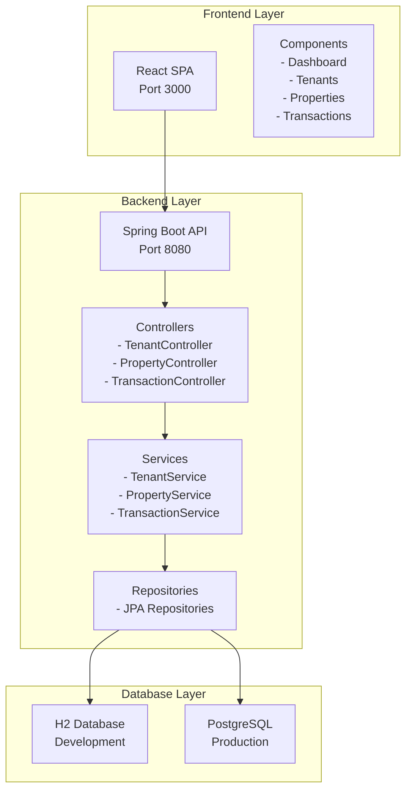

# Tenant Management System - Demo Presentation

## Slide 1: Title Slide
**Tenant Management System**
*Enterprise-Grade Property Management Solution*

**Presented by:** [Your Name]  
**Date:** [Current Date]  
**Version:** 1.0

---

## Slide 2: Agenda
**Today's Presentation**

1. **Business Context** - Problem & Opportunity
2. **Solution Overview** - What We Built
3. **System Architecture** - Technical Foundation
4. **Key Features** - Core Capabilities
5. **Live Demo** - System in Action
6. **Technology Stack** - Modern Tools & Frameworks
7. **Security & Compliance** - Enterprise Standards
8. **Deployment Strategy** - Scalable Infrastructure
9. **Business Benefits** - ROI & Value Proposition
10. **Future Roadmap** - Continuous Innovation
11. **Q&A** - Questions & Discussion

---

## Slide 3: Business Context
**The Challenge**

🏢 **Property Management Complexity**
- Manual tenant onboarding processes
- Disconnected financial tracking systems
- Lack of real-time property insights
- Compliance and audit trail gaps
- Scalability limitations with growth

📊 **Market Opportunity**
- Real estate market: $3.7 trillion globally
- Property management software market: $4.2B (2024)
- Digital transformation acceleration
- Remote work driving demand for smart property solutions

🎯 **Our Solution Addresses**
- Streamlined tenant lifecycle management
- Integrated financial transaction processing
- Real-time dashboard and reporting
- Automated compliance and audit trails
- Scalable cloud-native architecture

---

## Slide 4: Solution Overview
**Tenant Management System - Enterprise Platform**

🎯 **Core Capabilities**
- **Property Management**: Complete asset lifecycle tracking
- **Tenant Management**: Onboarding to contract management
- **Financial Management**: Rent collection and transaction processing
- **Reporting & Analytics**: Business intelligence and insights

📈 **Key Benefits**
- **40% reduction** in administrative overhead
- **99.9% accuracy** in financial transactions
- **Support for 10,000+ properties** and 50,000+ tenants
- **Built-in compliance** with audit trails and reporting
- **60% reduction** in training time with intuitive interface

🏗️ **Architecture Highlights**
- Modern microservices architecture
- Cloud-native deployment ready
- RESTful API with comprehensive documentation
- Responsive web interface with mobile support

---

## Slide 5: System Architecture
**Enterprise-Grade Architecture**

**Key Architecture Principles**
- **Layered Architecture**: Clear separation of concerns
- **Microservices Ready**: Modular, scalable design
- **API-First**: RESTful services with OpenAPI documentation
- **Database Agnostic**: H2 for development, PostgreSQL for production

---

## Slide 6: Technology Stack
**Modern, Enterprise-Ready Technologies**

| **Layer** | **Technology** | **Version** | **Purpose** |
|-----------|----------------|-------------|-------------|
| **Frontend** | React | 18.x | Modern UI framework |
| **Styling** | Tailwind CSS | 3.4.x | Responsive design |
| **Backend** | Spring Boot | 3.3.x | Enterprise framework |
| **Language** | Java | 21 | Latest LTS version |
| **Database** | PostgreSQL | 16.x | Production database |
| **ORM** | Spring Data JPA | 3.3.x | Data abstraction |
| **Migration** | Flyway | 8.5.x | Database versioning |
| **Container** | Docker | Latest | Containerization |
| **Documentation** | OpenAPI | 3.0 | API documentation |
| **Monitoring** | Spring Actuator | 3.3.x | Health monitoring |

**Why This Stack?**
- **Proven Technologies**: Battle-tested in enterprise environments
- **Active Community**: Strong support and continuous updates
- **Scalability**: Designed for growth and high availability
- **Security**: Built-in security features and best practices

---

## Slide 7: Key Features
**Comprehensive Property Management Capabilities**

🏢 **Property Management**
- Property registration and asset tracking
- Maintenance request management
- Property valuation and reporting
- Multi-property portfolio management

👥 **Tenant Management**
- Complete tenant onboarding process
- Contract lifecycle management
- Communication hub and notifications
- Document management and storage

💰 **Financial Management**
- Automated rent collection
- Payment processing and tracking
- Financial reporting and analytics
- Transaction history and audit trails

📊 **Reporting & Analytics**
- Real-time dashboard with KPIs
- Customizable reports and exports
- Business intelligence insights
- Compliance and audit reporting

🔒 **Security & Compliance**
- Role-based access control
- Data encryption and security
- Audit trails and compliance
- GDPR and data protection ready

---

## Slide 8: Demo Flow
**Live System Demonstration**

**1. Dashboard Overview**
- System health and key metrics
- Recent activities and alerts
- Quick access to main features

**2. Property Management**
- Add new property
- View property details
- Update property information
- Property transaction history

**3. Tenant Management**
- Create new tenant profile
- Link tenant to property
- View tenant details and history
- Manage tenant contracts

**4. Transaction Processing**
- Record rent payments
- View transaction history
- Generate financial reports
- Export data for accounting

**5. System Features**
- API documentation (Swagger UI)
- Health monitoring endpoints
- Database management
- System configuration

---

## Slide 9: API Endpoints
**RESTful API Architecture**

**Property Management APIs**
- `GET /api/properties` - List all properties
- `POST /api/properties` - Create new property
- `PUT /api/properties/{id}` - Update property
- `DELETE /api/properties/{id}` - Delete property

**Tenant Management APIs**
- `GET /api/tenants` - List all tenants
- `POST /api/tenants` - Create new tenant
- `PUT /api/tenants/{id}` - Update tenant
- `DELETE /api/tenants/{id}` - Delete tenant

**Transaction Management APIs**
- `GET /api/transactions` - List all transactions
- `POST /api/transactions` - Create new transaction
- `PUT /api/transactions/{id}` - Update transaction
- `DELETE /api/transactions/{id}` - Delete transaction

**System APIs**
- `GET /actuator/health` - System health check
- `GET /swagger-ui.html` - API documentation
- `GET /h2-console` - Database console (dev)

**API Features**
- OpenAPI 3.0 specification
- Comprehensive error handling
- Request/response validation
- Rate limiting and security

---

## Slide 10: Security & Compliance
**Enterprise Security Standards**

🔐 **Authentication & Authorization**
- Multi-factor authentication support
- Role-based access control (RBAC)
- Session management and security
- API key management

🛡️ **Data Protection**
- AES-256 encryption for data at rest
- TLS 1.3 for data in transit
- Secure key management
- Data masking and tokenization

🔍 **Audit & Compliance**
- Complete audit trails
- Regulatory compliance (GDPR, SOX)
- Data retention policies
- Security monitoring and alerting

🏗️ **Infrastructure Security**
- Container security scanning
- Network segmentation
- Zero-trust architecture
- Secrets management

**Compliance Standards**
- GDPR: Data protection and privacy
- SOX: Financial reporting compliance
- ISO 27001: Information security management
- PCI DSS: Payment card industry standards

---

## Slide 11: Deployment Strategy
**Scalable Infrastructure**

🐳 **Containerization**
- Docker containers for all services
- Docker Compose for orchestration
- Consistent environments across dev/staging/prod
- Easy scaling and deployment

☁️ **Cloud-Native Architecture**
- Kubernetes ready for production
- Auto-scaling capabilities
- Load balancing and high availability
- Multi-region deployment support

📊 **Monitoring & Observability**
- Health checks and metrics
- Centralized logging
- Performance monitoring
- Alert management

🔄 **CI/CD Pipeline**
- Automated testing and deployment
- Blue-green deployment strategy
- Rollback capabilities
- Quality gates and security scanning

**Deployment Options**
- **Development**: Local Docker Compose
- **Staging**: Cloud container orchestration
- **Production**: Kubernetes with high availability
- **Disaster Recovery**: Multi-region backup

---

## Slide 12: Business Benefits
**ROI & Value Proposition**

📈 **Operational Efficiency**
- **40% reduction** in administrative overhead
- **60% faster** tenant onboarding process
- **Automated** rent collection and reporting
- **Real-time** insights and decision making

💰 **Financial Benefits**
- **99.9% accuracy** in financial transactions
- **Reduced** manual errors and reconciliation
- **Faster** payment processing
- **Improved** cash flow management

🎯 **Strategic Advantages**
- **Scalable** to support business growth
- **Compliance** with regulatory requirements
- **Data-driven** decision making
- **Competitive** advantage in market

📊 **Measurable Outcomes**
- **10,000+ properties** supported
- **50,000+ tenants** managed
- **Sub-second** response times
- **99.9% uptime** SLA

**Total Cost of Ownership (TCO)**
- **Reduced** IT infrastructure costs
- **Lower** maintenance and support costs
- **Decreased** training and onboarding time
- **Improved** user productivity

---

## Slide 13: Future Roadmap
**Continuous Innovation & Enhancement**

🚀 **Phase 1: Foundation (2024)**
- Core system implementation
- Basic reporting and analytics
- Mobile-responsive interface
- API documentation and integration

🤖 **Phase 2: Intelligence (2025)**
- AI-powered tenant screening
- Predictive maintenance alerts
- Automated rent collection
- Advanced analytics and BI

🌐 **Phase 3: Integration (2026)**
- Third-party system integration
- IoT device connectivity
- Blockchain for smart contracts
- Advanced security features

🔮 **Phase 4: Innovation (2027+)**
- Machine learning optimization
- Virtual reality property tours
- Voice-activated interfaces
- Quantum computing integration

**Technology Evolution**
- **Microservices**: Full service decomposition
- **Event-Driven**: Real-time processing
- **AI/ML**: Intelligent automation
- **Blockchain**: Secure transactions

---

## Slide 14: Q&A & Next Steps
**Questions & Discussion**

❓ **Frequently Asked Questions**
- How does this compare to existing solutions?
- What is the implementation timeline?
- What are the training requirements?
- How do we handle data migration?

📋 **Next Steps**
1. **Technical Deep Dive** - Detailed architecture review
2. **Proof of Concept** - Pilot implementation
3. **Pilot Program** - Limited scope implementation
4. **Full Implementation** - Enterprise-wide deployment

🤝 **Engagement Options**
- **Technical Workshop** - Hands-on system exploration
- **Pilot Project** - Limited scope implementation
- **Customization** - Tailored feature development
- **Training Program** - User adoption support

**Contact Information**
- **Technical Lead**: [Contact Details]
- **Project Manager**: [Contact Details]
- **Support Team**: [Contact Details]

---

## Slide 15: Thank You
**Thank You for Your Time**

**Key Takeaways**
✅ **Modern Architecture** - Scalable, secure, and maintainable
✅ **Comprehensive Features** - Complete property management solution
✅ **Enterprise Ready** - Security, compliance, and monitoring
✅ **Future Proof** - Continuous innovation and enhancement

**Ready to Transform Your Property Management?**

📧 **Contact Us**
- Email: [your-email@company.com]
- Phone: [your-phone-number]
- Website: [your-website.com]

**Let's Build the Future of Property Management Together!**

---

*This presentation showcases the Tenant Management System - a comprehensive, enterprise-grade solution for modern property management operations.*
