# API Architecture

This document describes the REST API design, endpoints, and integration patterns for the Tenant Management System.

## API Overview

The system provides a RESTful API built with Spring Boot, following REST principles and OpenAPI standards.

## API Architecture Diagram

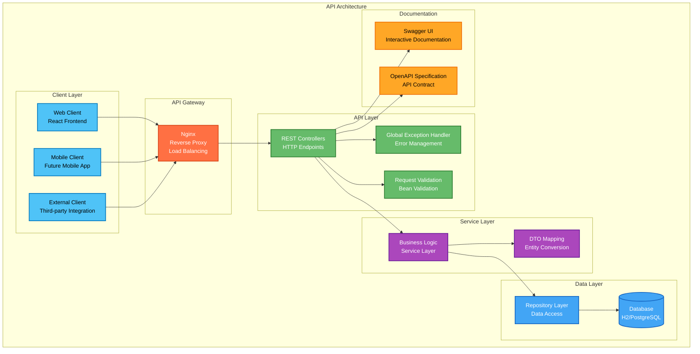

## API Endpoints

### Tenant Management API

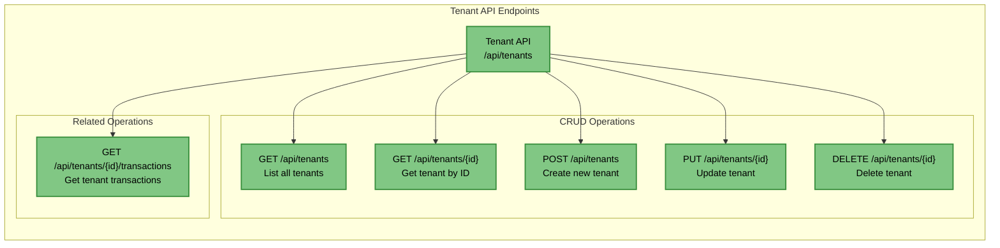

### Property Management API

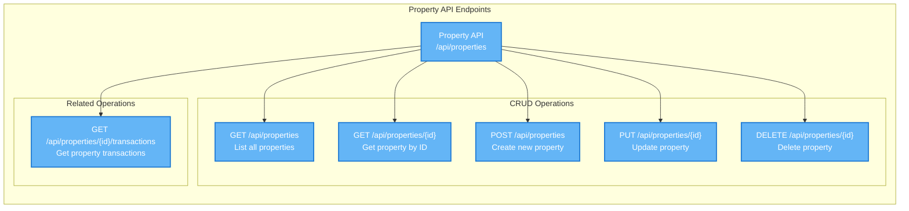

### Transaction Management API

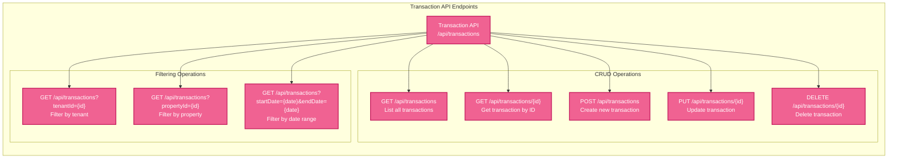

## API Request/Response Flow

### Request Processing Flow

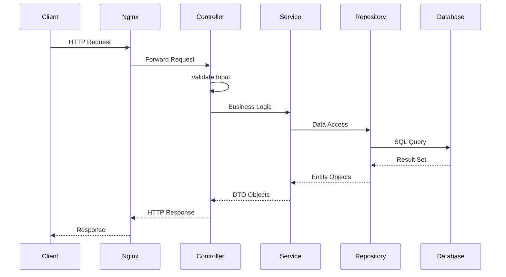

### Error Handling Flow

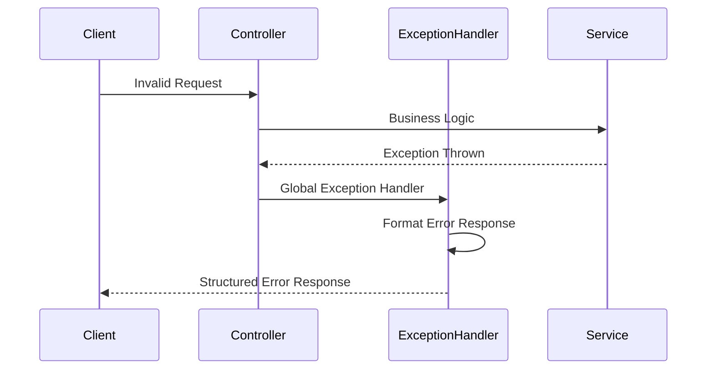

## API Data Models

### DTO Structure

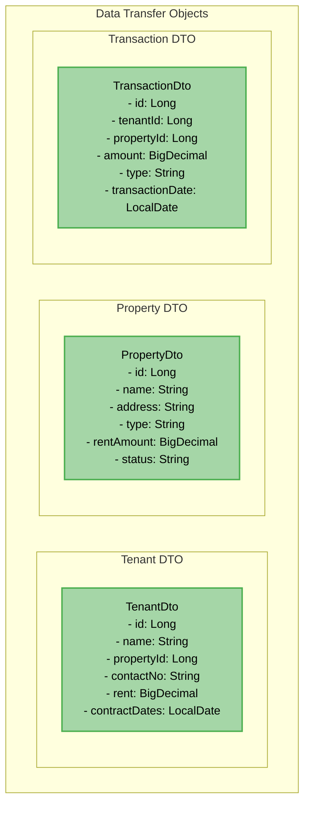

### Entity Relationships

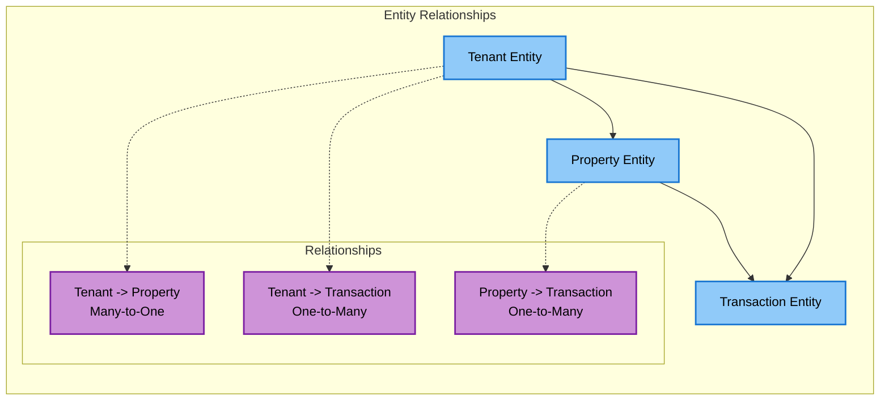

## API Documentation

### Swagger/OpenAPI Integration

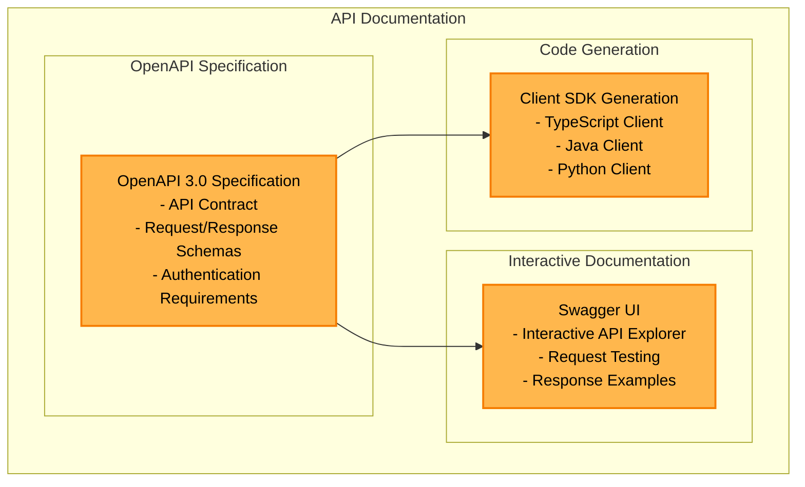

## API Security

### Security Layers

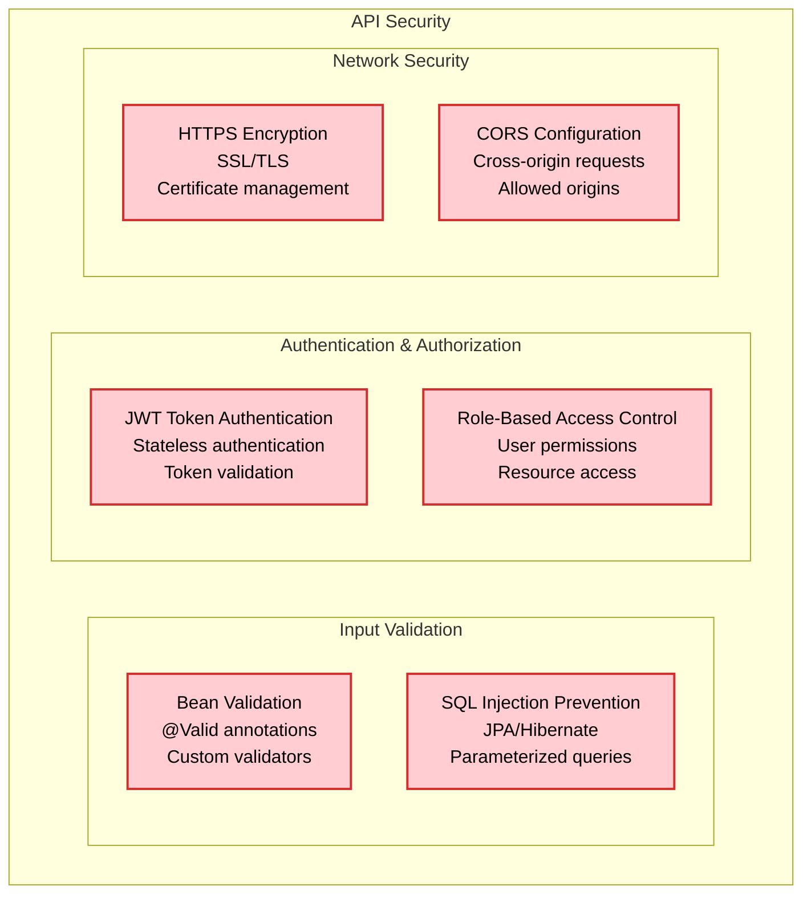

## API Performance

### Performance Optimization

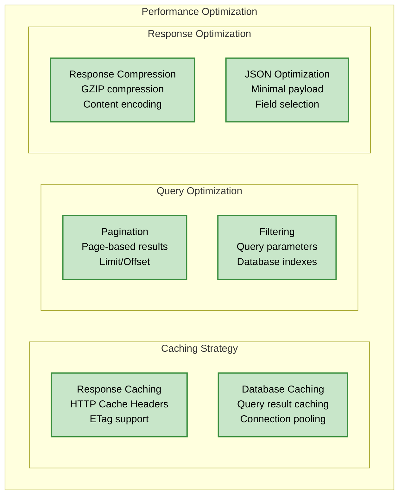

## API Testing

### Testing Strategy

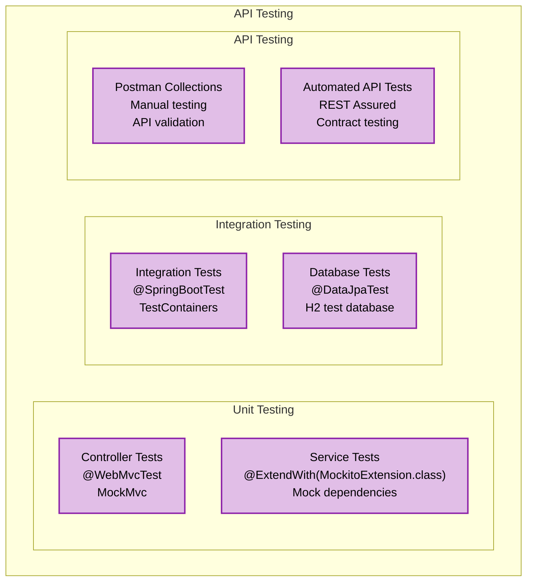

## API Versioning

### Versioning Strategy

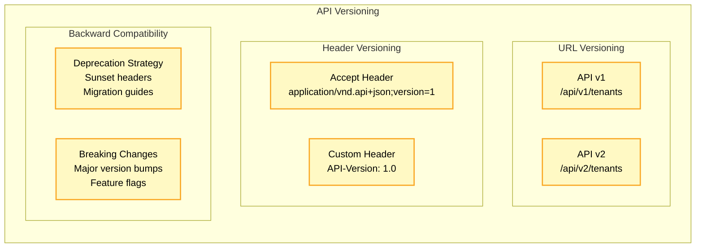

## API Monitoring

### Monitoring and Observability

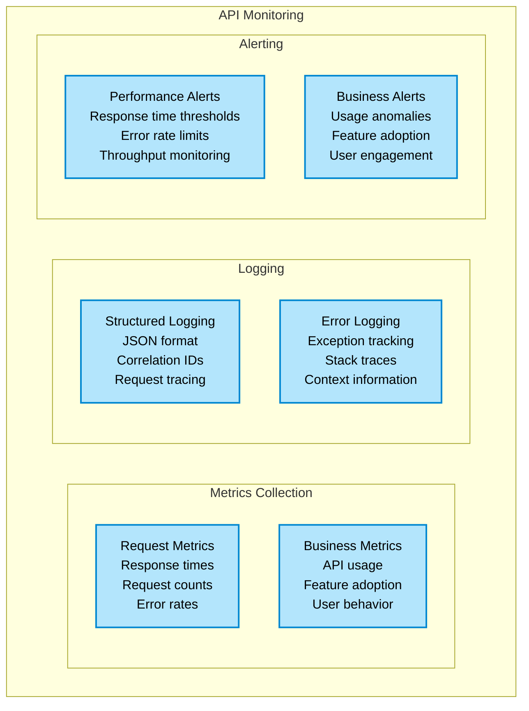
