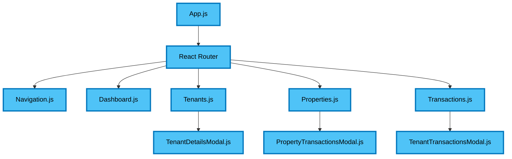
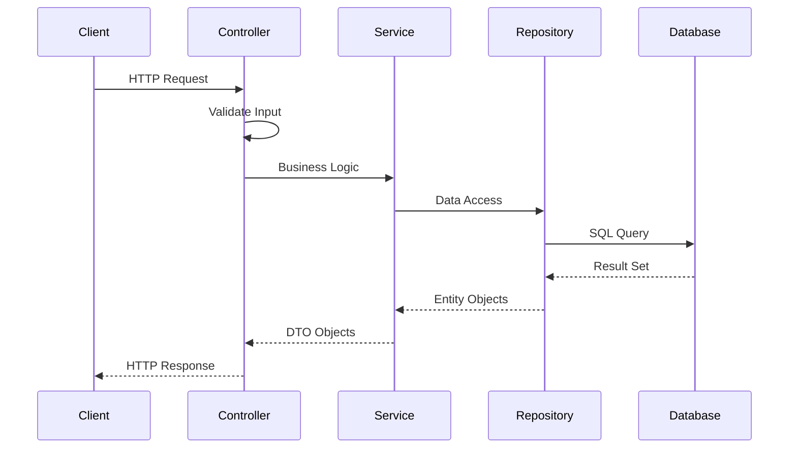
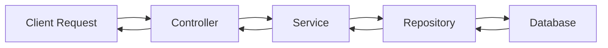
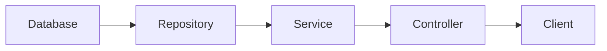
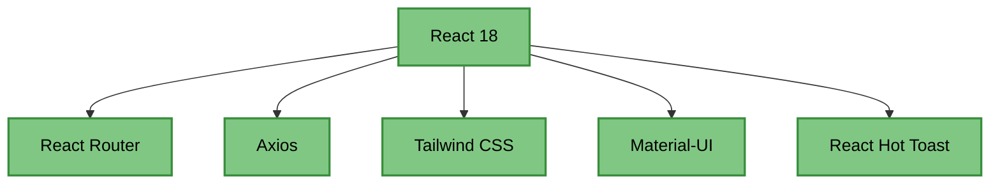
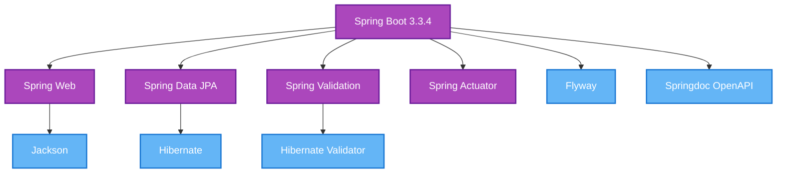

# Component Architecture

This document details the component interactions and relationships within the Tenant Management System.

## Component Overview

The system is built using a modular component architecture with clear interfaces and dependencies.

## Component Architecture Diagram

```mermaid
graph TB
    subgraph "Frontend Components"
        App["App.js<br/>Main Application"]
        Nav["Navigation.js<br/>Navigation Bar"]
        Dashboard["Dashboard.js<br/>Overview Dashboard"]
        Tenants["Tenants.js<br/>Tenant Management"]
        Properties["Properties.js<br/>Property Management"]
        Transactions["Transactions.js<br/>Transaction Management"]
        
        subgraph "Modal Components"
            TenantModal["TenantDetailsModal.js"]
            PropertyModal["PropertyTransactionsModal.js"]
            TransactionModal["TenantTransactionsModal.js"]
        end
    end
    
    subgraph "Backend Components"
        subgraph "Web Layer"
            TenantController[TenantController]
            PropertyController[PropertyController]
            TransactionController[TransactionController]
            ExceptionHandler[GlobalExceptionHandler]
        end
        
        subgraph "Service Layer"
            TenantService[TenantService]
            PropertyService[PropertyService]
            TransactionService[TransactionService]
            MappingService[Mapping Service]
        end
        
        subgraph "Repository Layer"
            TenantRepo[TenantRepository]
            PropertyRepo[PropertyRepository]
            TransactionRepo[TransactionRepository]
        end
        
        subgraph "Domain Layer"
            TenantEntity[Tenant Entity]
            PropertyEntity[Property Entity]
            TransactionEntity[Transaction Entity]
        end
        
        subgraph "DTO Layer"
            TenantDto[TenantDto]
            PropertyDto[PropertyDto]
            TransactionDto[TransactionDto]
        end
    end
    
    subgraph "External Components"
        Database[(Database<br/>H2/PostgreSQL)]
        Swagger[Swagger UI]
        Actuator[Spring Actuator]
    end
    
    %% Frontend connections
    App --> Nav
    App --> Dashboard
    App --> Tenants
    App --> Properties
    App --> Transactions
    
    Tenants --> TenantModal
    Properties --> PropertyModal
    Transactions --> TransactionModal
    
    %% Frontend to Backend
    Tenants --> TenantController
    Properties --> PropertyController
    Transactions --> TransactionController
    
    %% Backend internal connections
    TenantController --> TenantService
    PropertyController --> PropertyService
    TransactionController --> TransactionService
    
    TenantController --> ExceptionHandler
    PropertyController --> ExceptionHandler
    TransactionController --> ExceptionHandler
    
    TenantService --> MappingService
    PropertyService --> MappingService
    TransactionService --> MappingService
    
    TenantService --> TenantRepo
    PropertyService --> PropertyRepo
    TransactionService --> TransactionRepo
    
    TenantRepo --> TenantEntity
    PropertyRepo --> PropertyEntity
    TransactionRepo --> TransactionEntity
    
    TenantController --> TenantDto
    PropertyController --> PropertyDto
    TransactionController --> TransactionDto
    
    %% External connections
    TenantRepo --> Database
    PropertyRepo --> Database
    TransactionRepo --> Database
    
    TenantController --> Swagger
    PropertyController --> Swagger
    TransactionController --> Swagger
    
    TenantController --> Actuator
    PropertyController --> Actuator
    TransactionController --> Actuator
    
    %% Styling
    classDef frontend fill:#4fc3f7,stroke:#0277bd,stroke-width:3px,color:#000
    classDef backend fill:#66bb6a,stroke:#2e7d32,stroke-width:3px,color:#fff
    classDef database fill:#42a5f5,stroke:#1565c0,stroke-width:3px,color:#fff
    classDef external fill:#ab47bc,stroke:#6a1b9a,stroke-width:3px,color:#fff
    
    class App,Nav,Dashboard,Tenants,Properties,Transactions,TenantModal,PropertyModal,TransactionModal frontend
    class TenantController,PropertyController,TransactionController,TenantService,PropertyService,TransactionService,MappingService,TenantRepo,PropertyRepo,TransactionRepo,TenantEntity,PropertyEntity,TransactionEntity,TenantDto,PropertyDto,TransactionDto,ExceptionHandler backend
    class Database database
    class Swagger,Actuator external
```

## Component Interactions

### Frontend Component Hierarchy

### Backend Component Flow

## Component Responsibilities

### Frontend Components

| Component | Responsibility | Dependencies |
|-----------|----------------|--------------|
| **App.js** | Main application, routing setup | React Router |
| **Navigation.js** | Navigation menu and routing | React Router |
| **Dashboard.js** | Overview and statistics | API calls |
| **Tenants.js** | Tenant list and management | TenantController API |
| **Properties.js** | Property list and management | PropertyController API |
| **Transactions.js** | Transaction list and management | TransactionController API |
| **TenantDetailsModal.js** | Tenant creation/editing | TenantController API |
| **PropertyTransactionsModal.js** | Property transaction details | TransactionController API |
| **TenantTransactionsModal.js** | Tenant transaction details | TransactionController API |

### Backend Components

| Component | Responsibility | Dependencies |
|-----------|----------------|--------------|
| **Controllers** | HTTP request handling, validation | Services, DTOs |
| **Services** | Business logic, data transformation | Repositories, Mapping |
| **Repositories** | Data access, database operations | Entities, JPA |
| **Entities** | Domain models, database mapping | JPA annotations |
| **DTOs** | Data transfer objects | Validation annotations |
| **ExceptionHandler** | Global error handling | All controllers |

## Data Flow

### Request Flow

### Response Flow

## Component Dependencies

### Frontend Dependencies

### Backend Dependencies

## Component Testing Strategy

### Frontend Testing
- **Unit Tests**: Individual component testing with React Testing Library
- **Integration Tests**: Component interaction testing
- **E2E Tests**: Full user workflow testing

### Backend Testing
- **Unit Tests**: Service and repository layer testing
- **Integration Tests**: Controller and database integration
- **API Tests**: REST endpoint testing

## Component Evolution

### Future Enhancements
- **Microservices**: Extract services into separate applications
- **Event-Driven**: Add event publishing and consumption
- **Caching**: Implement Redis for caching layer
- **Security**: Add authentication and authorization
- **Monitoring**: Enhanced observability and metrics

### Scalability Considerations
- **Horizontal Scaling**: Stateless design for easy scaling
- **Database Scaling**: Read replicas and connection pooling
- **Caching Strategy**: Multi-level caching implementation
- **API Versioning**: Backward-compatible API evolution
