# Database Architecture

This document describes the database design, relationships, and data flow for the Tenant Management System.

## Database Overview

The system uses a relational database design with clear entity relationships and proper normalization.

## Entity Relationship Diagram

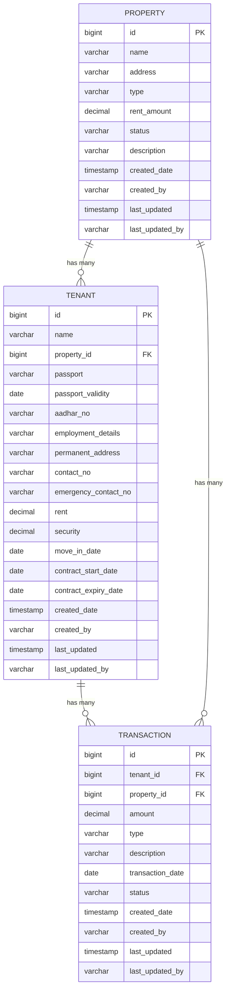

## Database Schema

### Tables Structure

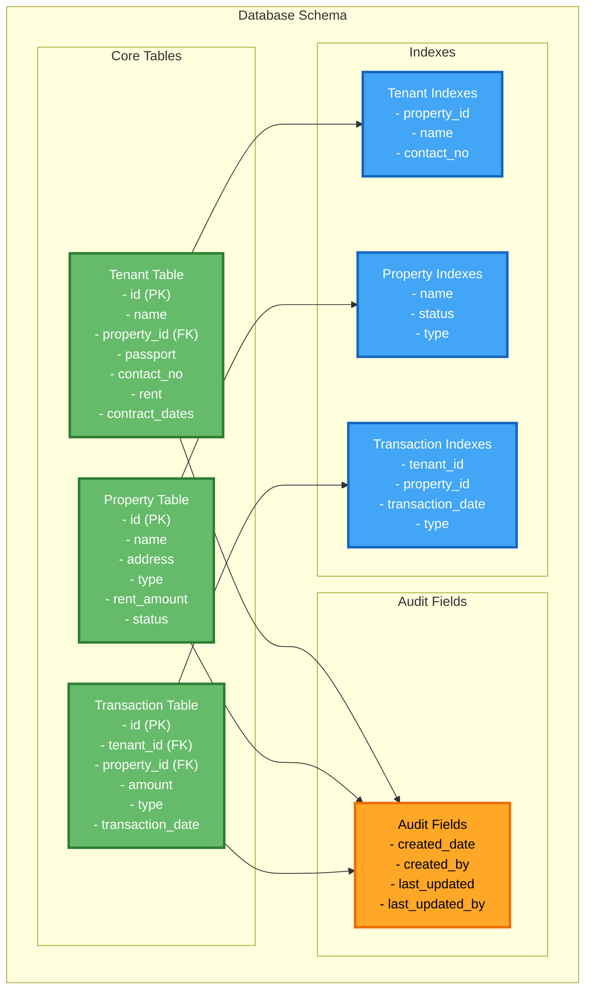

## Database Configuration

### Development (H2 Database)

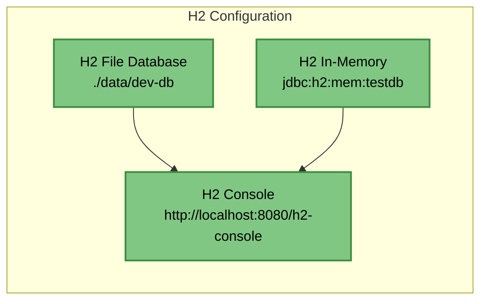

### Production (PostgreSQL)

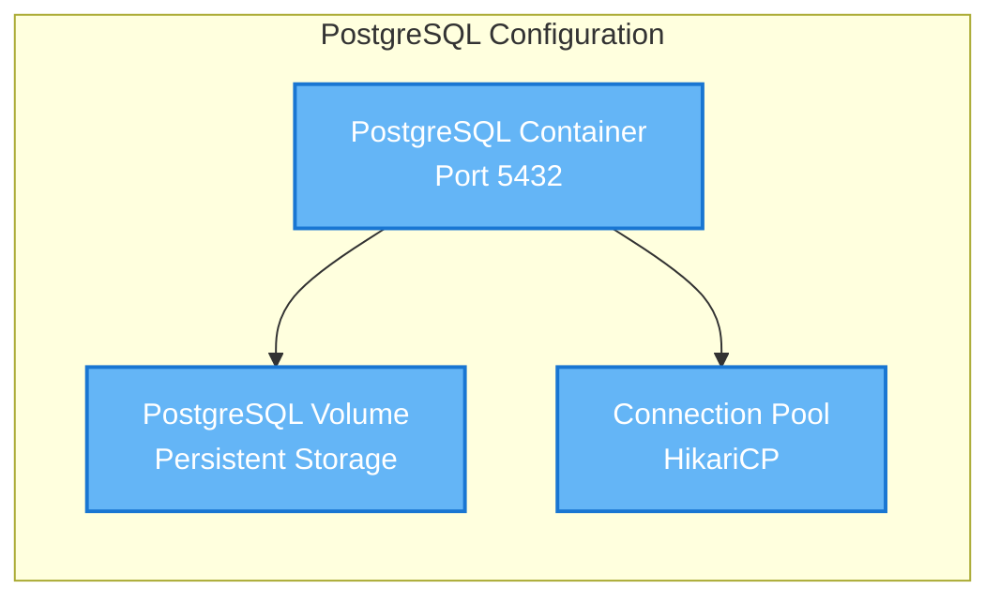

## Database Migrations

### Migration Strategy

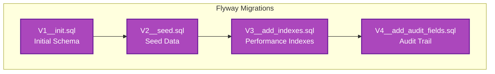

### Migration Files Structure

```
src/main/resources/db/migration/
├── V1__init.sql          # Initial schema creation
├── V2__seed.sql          # Seed data for development
├── V3__add_indexes.sql   # Performance optimization
└── V4__add_audit_fields.sql # Audit trail implementation
```

## Data Flow Architecture

### Read Operations

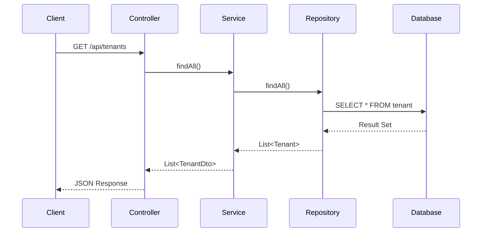

### Write Operations

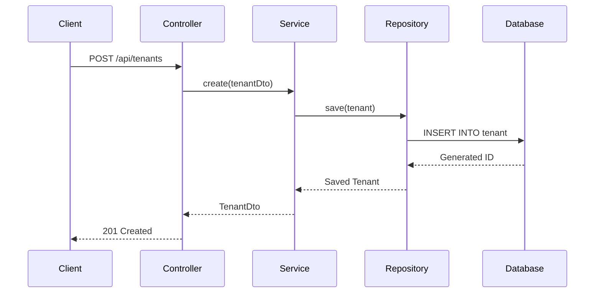

## Database Relationships

### One-to-Many Relationships

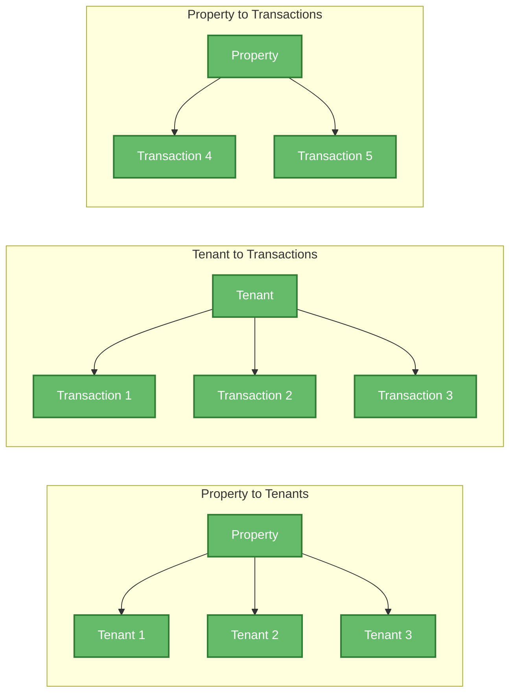

## Performance Optimization

### Database Indexes

```mermaid
graph TB
    subgraph "Index Strategy"
        PrimaryIndexes[Primary Key Indexes<br/>- tenant.id<br/>- property.id<br/>- transaction.id]
        ForeignKeyIndexes[Foreign Key Indexes<br/>- tenant.property_id<br/>- transaction.tenant_id<br/>- transaction.property_id]
        QueryIndexes[Query Optimization Indexes<br/>- tenant.name<br/>- tenant.contact_no<br/>- property.status<br/>- transaction.transaction_date]
        CompositeIndexes[Composite Indexes<br/>- (tenant_id, transaction_date)<br/>- (property_id, status)]
    end
    
    classDef index fill:#42a5f5,stroke:#1565c0,stroke-width:2px,color:#fff
    class PrimaryIndexes,ForeignKeyIndexes,QueryIndexes,CompositeIndexes index
```

### Connection Pooling

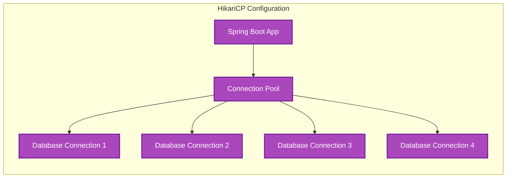

## Data Validation

### Database Constraints

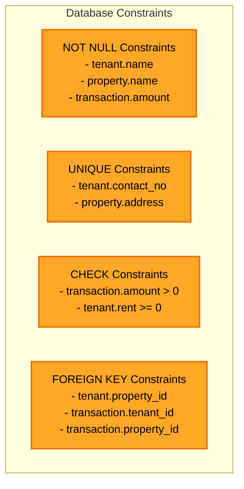

## Backup and Recovery

### Backup Strategy

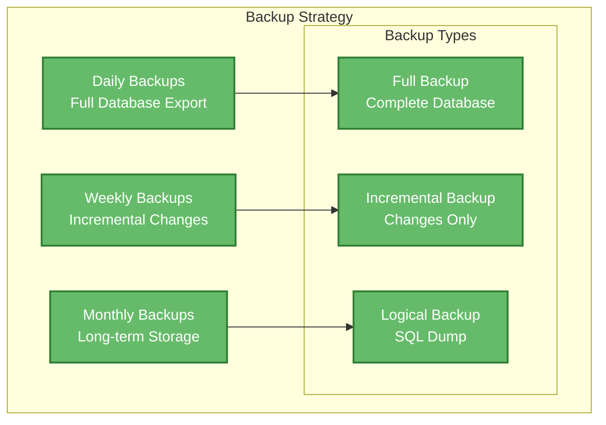

## Security Considerations

### Database Security

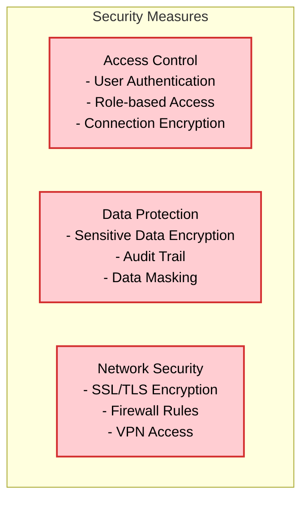

## Monitoring and Maintenance

### Database Monitoring

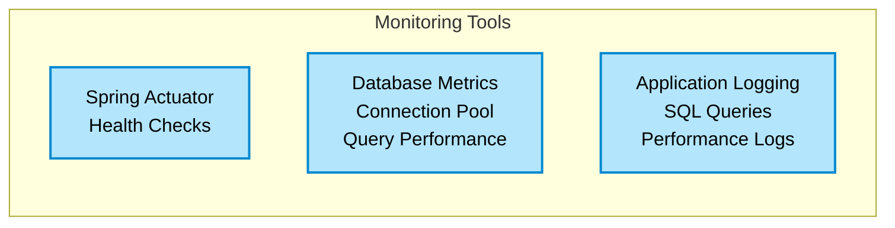
