# Deployment Architecture

This document describes the deployment architecture, infrastructure, and containerization strategy for the Tenant Management System.

## Deployment Overview

The system is designed for containerized deployment with Docker and Docker Compose, supporting both development and production environments.

## Container Architecture

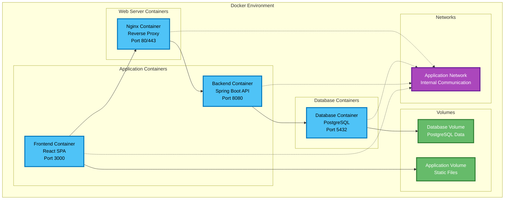

## Development Environment

### Local Development Setup

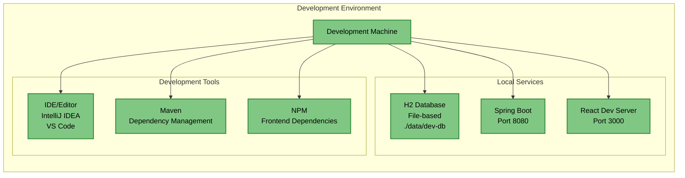

### Development Docker Compose

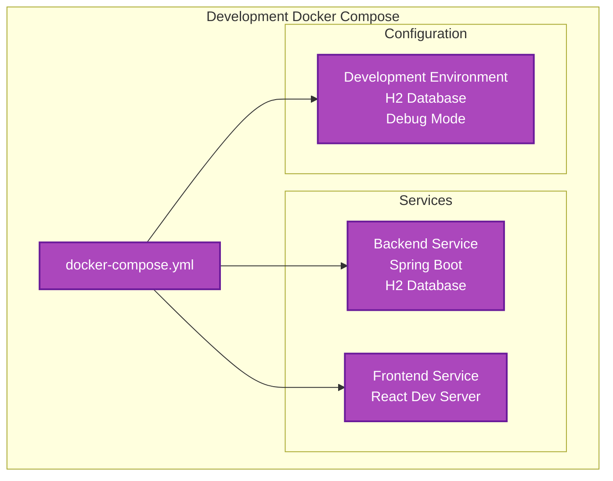

## Production Environment

### Production Deployment

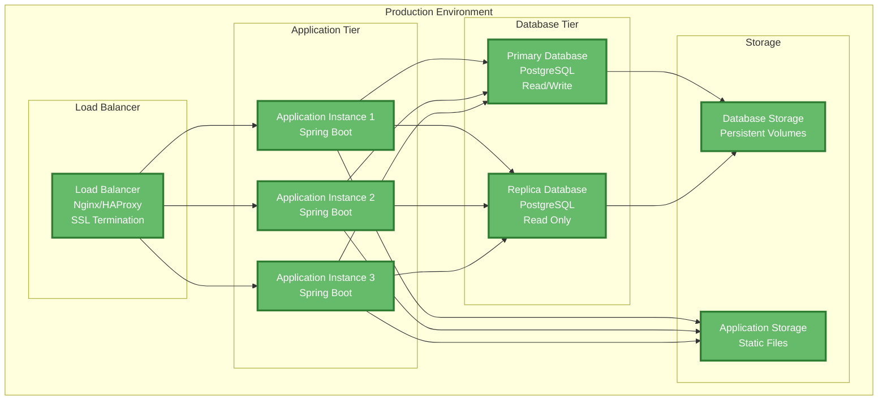

### Production Docker Compose

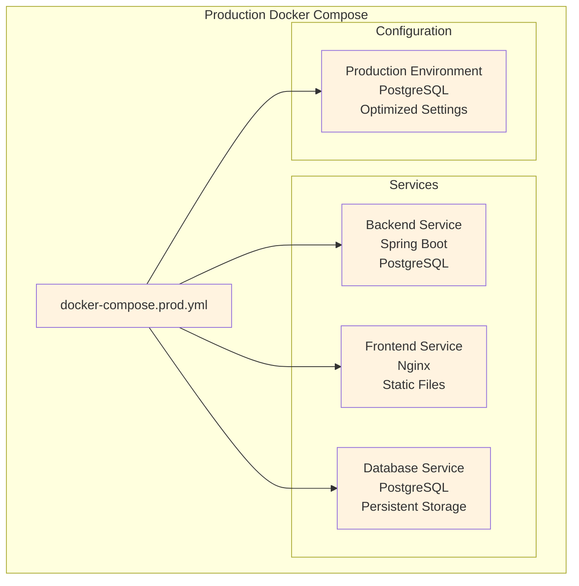

## Infrastructure Components

### Docker Configuration

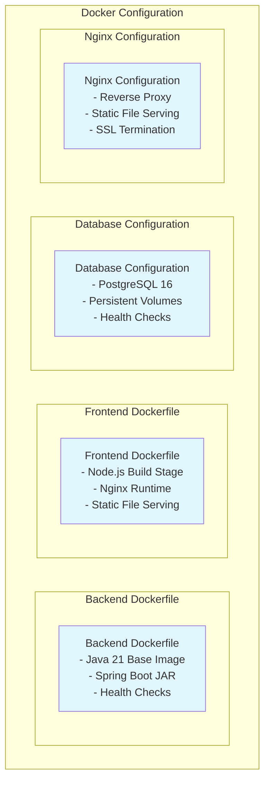

### Network Architecture

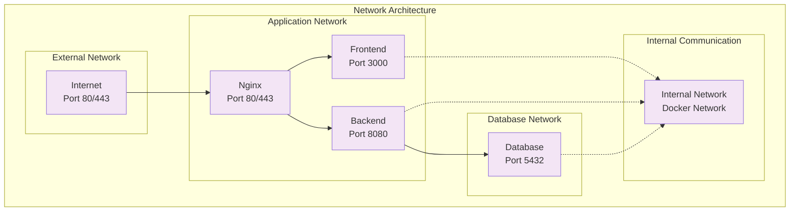

## Deployment Strategies

### Blue-Green Deployment

```mermaid
graph LR
    subgraph "Blue-Green Deployment"
        subgraph "Blue Environment"
            BlueLB[Blue Load Balancer]
            BlueApp[Blue Application]
            BlueDB[Blue Database]
        end
        
        subgraph "Green Environment"
            GreenLB[Green Load Balancer]
            GreenApp[Green Application]
            GreenDB[Green Database]
        end
        
        subgraph "Switch"
            Switch[Traffic Switch<br/>DNS/Load Balancer]
        end
    end
    
    Switch --> BlueLB
    Switch --> GreenLB
    
    BlueLB --> BlueApp
    GreenLB --> GreenApp
    
    BlueApp --> BlueDB
    GreenApp --> GreenDB
    
    classDef blue fill:#e1f5fe
    classDef green fill:#e8f5e8
    classDef switch fill:#fff3e0
    
    class BlueLB,BlueApp,BlueDB blue
    class GreenLB,GreenApp,GreenDB green
    class Switch switch
```

### Rolling Deployment

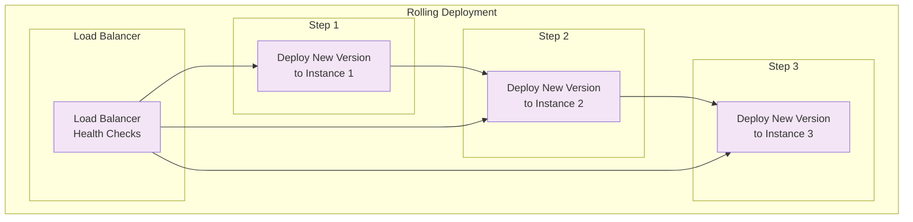

## Monitoring and Observability

### Application Monitoring

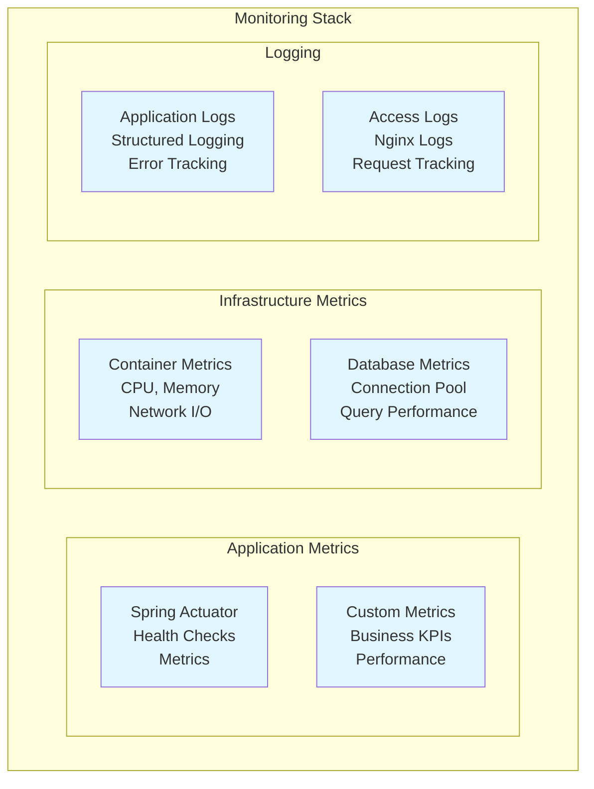

### Health Checks

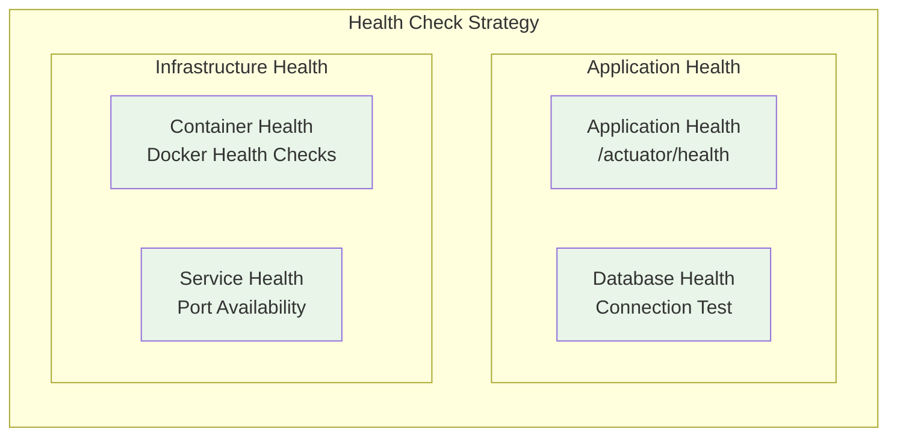

## Security Architecture

### Security Layers

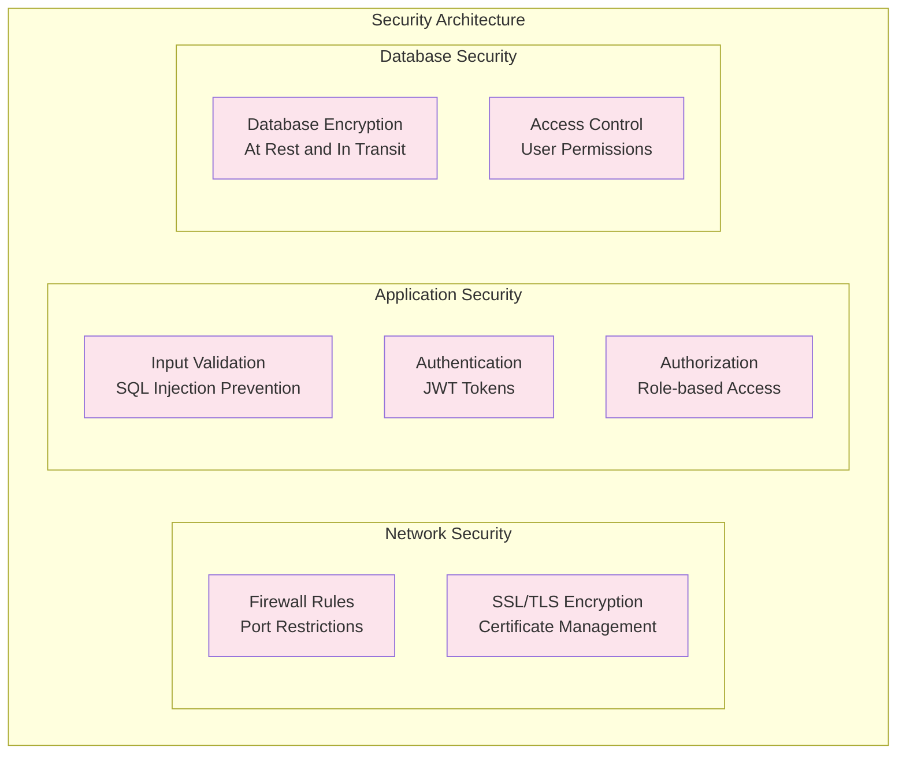

## Scaling Strategy

### Horizontal Scaling

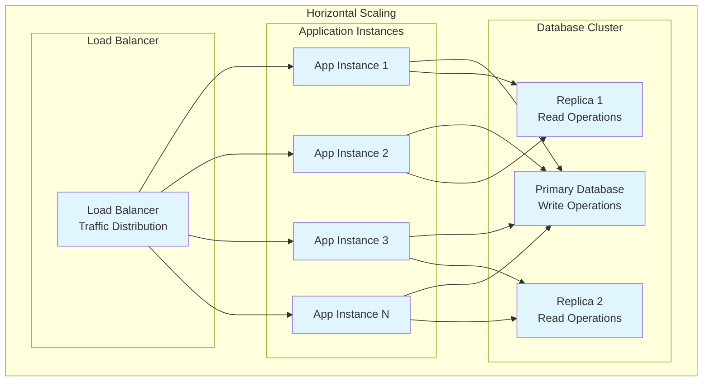

## Disaster Recovery

### Backup Strategy

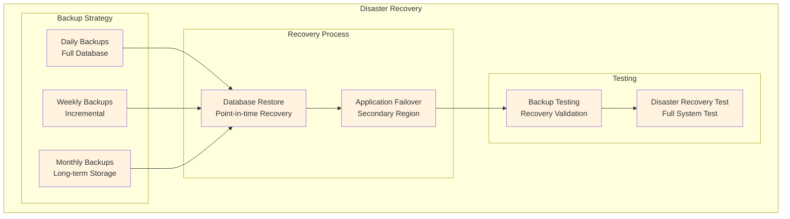
