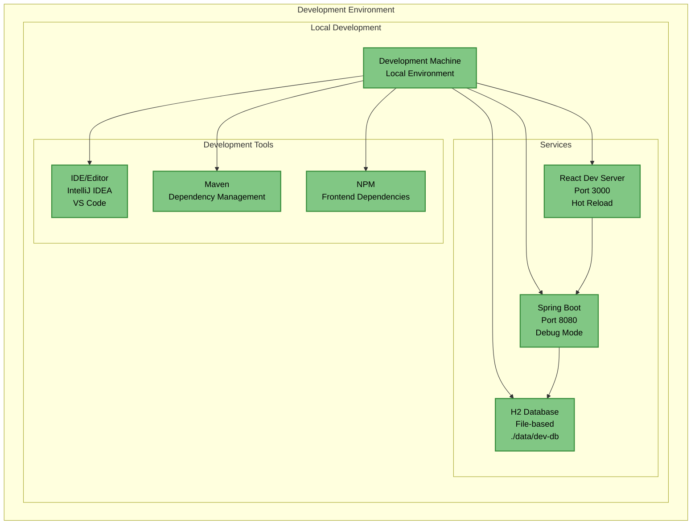
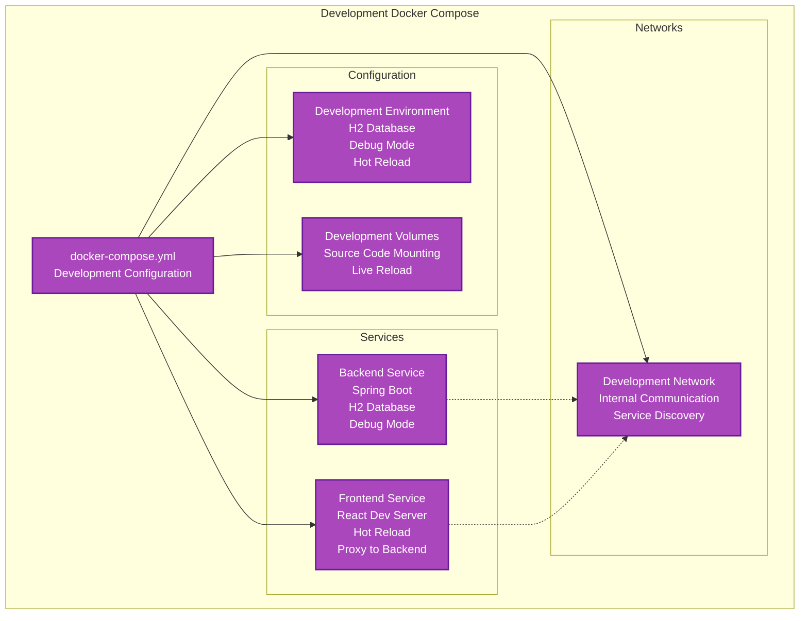
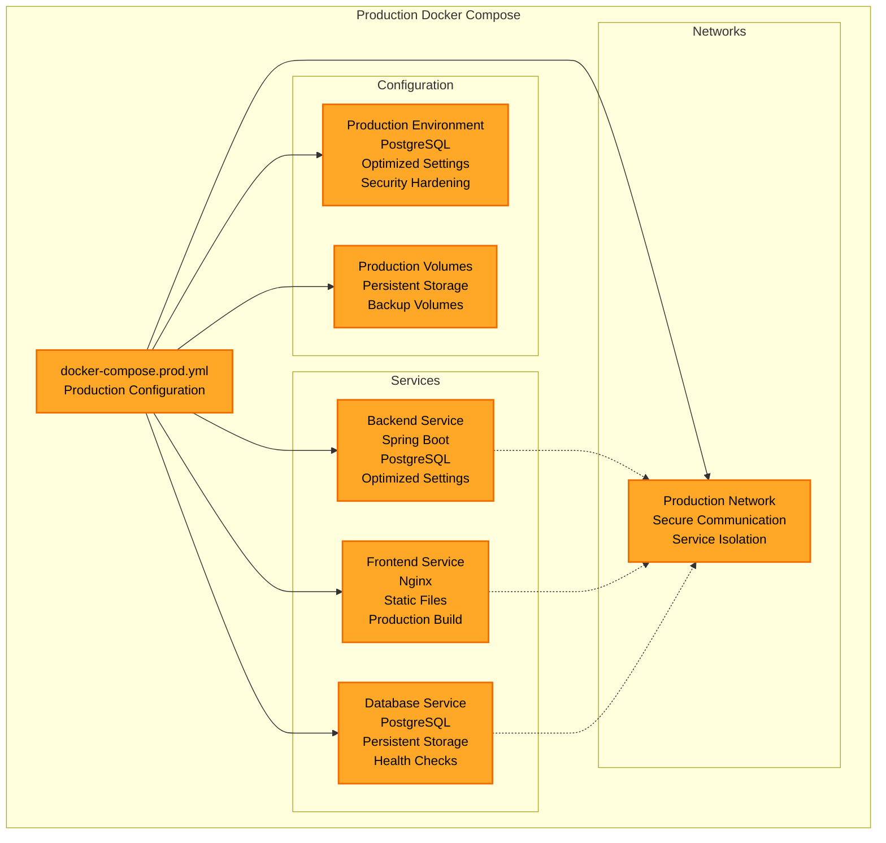
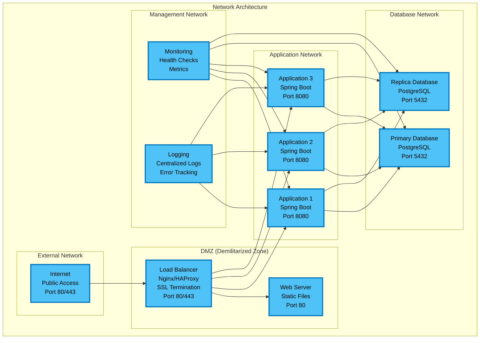
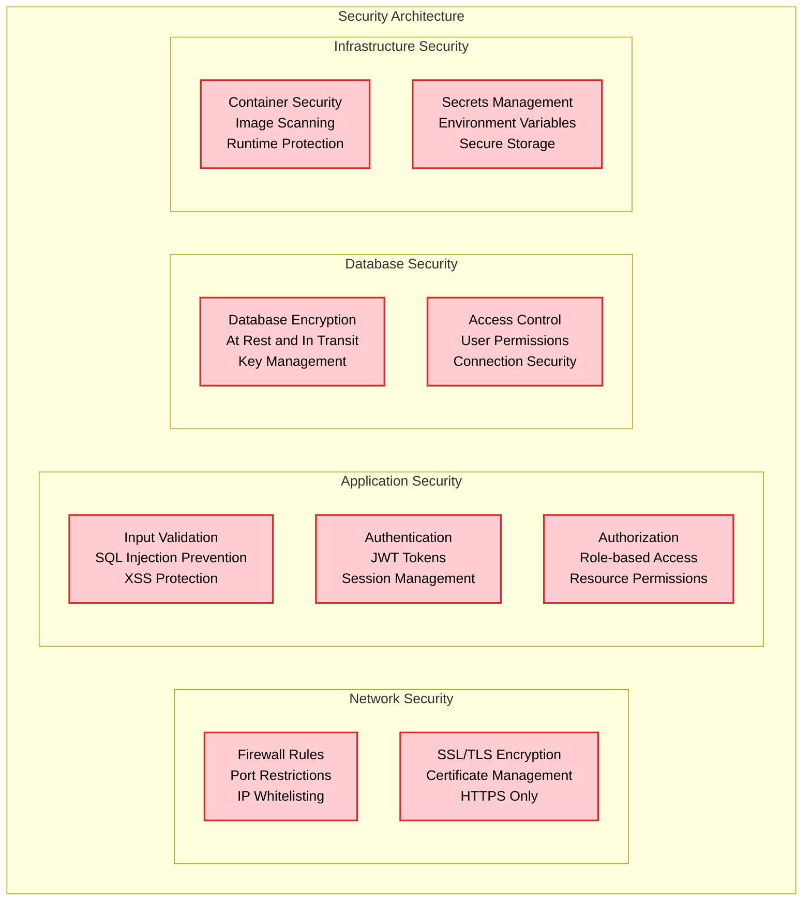
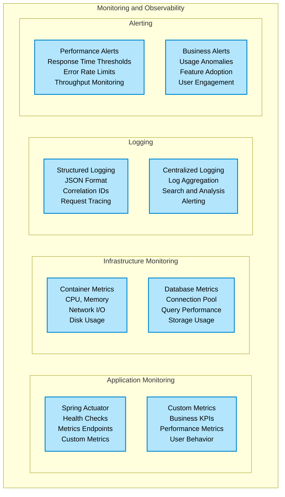
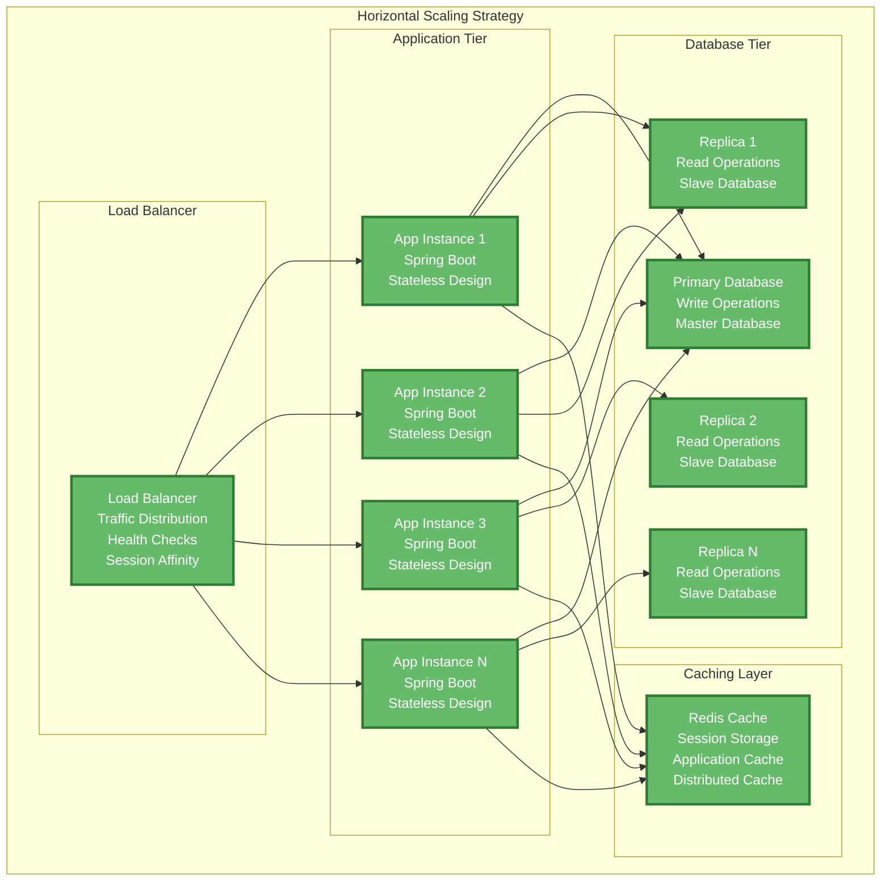
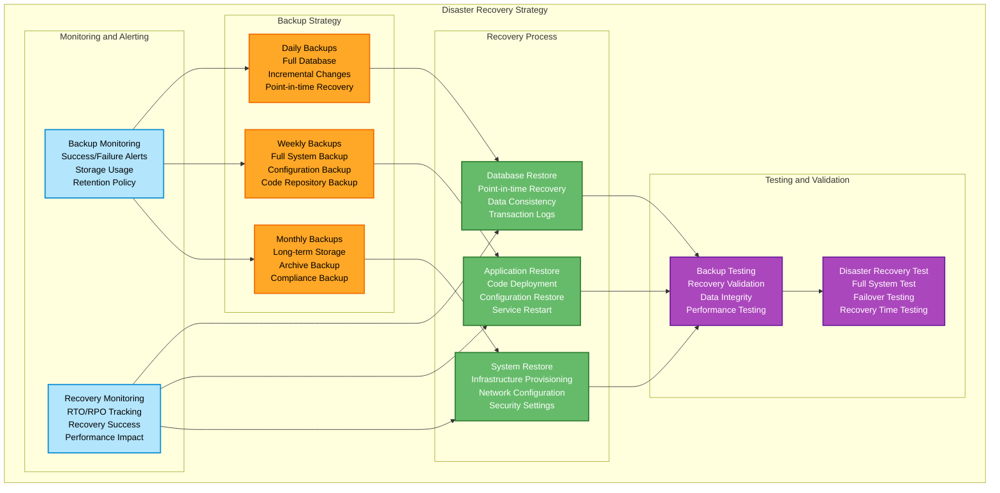
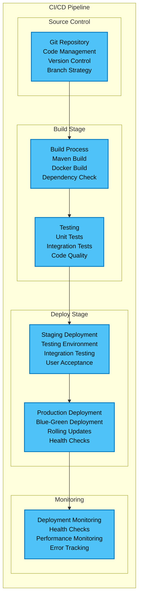

# Infrastructure Diagrams

This document contains comprehensive infrastructure and deployment diagrams for the Tenant Management System.

## Container Architecture

### Development Environment



### Production Environment

```mermaid
graph TB
    subgraph "Production Environment"
        subgraph "Load Balancer"
            LB[Load Balancer<br/>Nginx/HAProxy<br/>SSL Termination<br/>Port 80/443]
        end
        
        subgraph "Application Tier"
            App1[Application Instance 1<br/>Spring Boot<br/>Port 8080]
            App2[Application Instance 2<br/>Spring Boot<br/>Port 8080]
            App3[Application Instance 3<br/>Spring Boot<br/>Port 8080]
        end
        
        subgraph "Database Tier"
            PrimaryDB[Primary Database<br/>PostgreSQL<br/>Read/Write<br/>Port 5432]
            ReplicaDB[Replica Database<br/>PostgreSQL<br/>Read Only<br/>Port 5432]
        end
        
        subgraph "Storage"
            DBStorage[Database Storage<br/>Persistent Volumes<br/>Backup Storage]
            AppStorage[Application Storage<br/>Static Files<br/>Logs]
        end
        
        subgraph "Monitoring"
            Monitoring[Monitoring Stack<br/>Health Checks<br/>Metrics Collection<br/>Log Aggregation]
        end
    end
    
    LB --> App1
    LB --> App2
    LB --> App3
    
    App1 --> PrimaryDB
    App2 --> PrimaryDB
    App3 --> PrimaryDB
    
    App1 --> ReplicaDB
    App2 --> ReplicaDB
    App3 --> ReplicaDB
    
    PrimaryDB --> DBStorage
    ReplicaDB --> DBStorage
    App1 --> AppStorage
    App2 --> AppStorage
    App3 --> AppStorage
    
    Monitoring --> App1
    Monitoring --> App2
    Monitoring --> App3
    Monitoring --> PrimaryDB
    Monitoring --> ReplicaDB
    
    classDef production fill:#66bb6a,stroke:#2e7d32,stroke-width:3px,color:#fff
    class LB,App1,App2,App3,PrimaryDB,ReplicaDB,DBStorage,AppStorage,Monitoring production
```

## Docker Compose Architecture

### Development Docker Compose



### Production Docker Compose



## Network Architecture

### Network Topology



## Security Architecture

### Security Layers



## Monitoring and Observability

### Monitoring Stack



## Scaling Strategy

### Horizontal Scaling



## Disaster Recovery

### Backup and Recovery Strategy



## Deployment Pipelines

### CI/CD Pipeline


