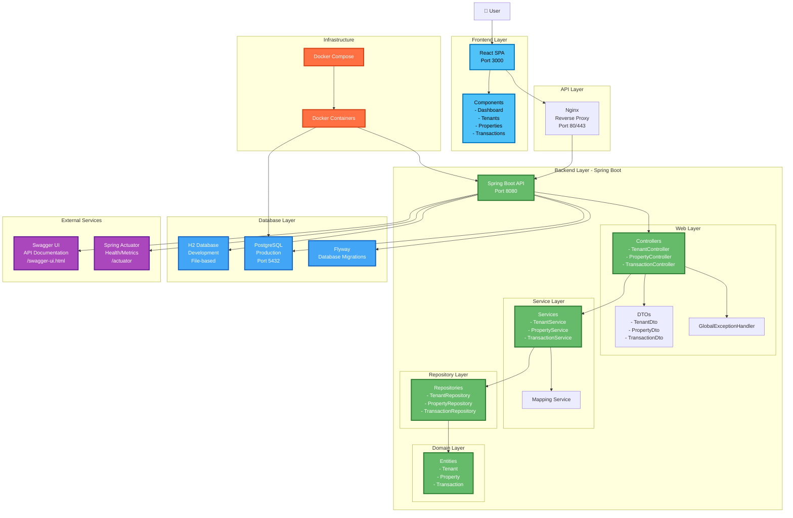
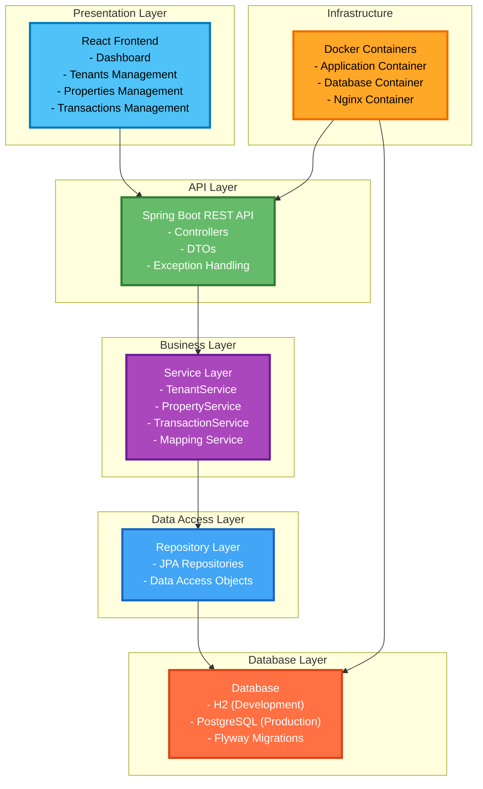

# System Architecture

This document provides a high-level overview of the Tenant Management System architecture.

## Architecture Overview

The system follows a modern, layered architecture with clear separation of concerns between the frontend, backend, and data layers.

## System Architecture Diagram

## Layered Architecture

## Architecture Principles

### 1. Separation of Concerns
- **Frontend**: User interface and user experience
- **Backend**: Business logic and data processing
- **Database**: Data persistence and integrity

### 2. Layered Architecture
- **Presentation Layer**: React components and UI logic
- **API Layer**: REST endpoints and request/response handling
- **Business Layer**: Core business logic and rules
- **Data Access Layer**: Database operations and ORM
- **Domain Layer**: Entity models and business objects

### 3. Dependency Injection
- Spring's IoC container manages object lifecycle
- Loose coupling between components
- Easy testing and mocking

### 4. Database Abstraction
- JPA/Hibernate for ORM
- Repository pattern for data access
- Flyway for version-controlled migrations

## Technology Stack

| Component | Technology | Version | Purpose |
|-----------|------------|---------|---------|
| **Frontend** | React | 18.2.0 | User interface |
| **Styling** | Tailwind CSS | 3.4.3 | Responsive design |
| **HTTP Client** | Axios | 1.4.0 | API communication |
| **Backend** | Spring Boot | 3.3.4 | Application framework |
| **Language** | Java | 21 | Programming language |
| **ORM** | Spring Data JPA | 3.3.4 | Database abstraction |
| **Database (Dev)** | H2 | 2.2.224 | In-memory database |
| **Database (Prod)** | PostgreSQL | 16 | Production database |
| **Migration** | Flyway | 8.5.13 | Database versioning |
| **Documentation** | Springdoc OpenAPI | 2.5.0 | API documentation |
| **Monitoring** | Spring Actuator | 3.3.4 | Health checks |
| **Container** | Docker | Latest | Containerization |
| **Orchestration** | Docker Compose | Latest | Multi-container management |
| **Web Server** | Nginx | Latest | Reverse proxy |

## Key Features

### Frontend Features
- **Responsive Design**: Mobile-first approach with Tailwind CSS
- **Component Architecture**: Reusable React components
- **State Management**: React hooks for local state
- **API Integration**: Axios for HTTP requests
- **Routing**: React Router for navigation

### Backend Features
- **RESTful APIs**: Standard HTTP methods and status codes
- **Validation**: Bean validation with custom error handling
- **Documentation**: Auto-generated OpenAPI/Swagger docs
- **Health Monitoring**: Actuator endpoints for monitoring
- **Database Migrations**: Version-controlled schema changes

### Infrastructure Features
- **Containerization**: Docker for consistent environments
- **Orchestration**: Docker Compose for multi-service management
- **Database Options**: H2 for development, PostgreSQL for production
- **Reverse Proxy**: Nginx for load balancing and SSL termination

## Security Considerations

- **Input Validation**: Server-side validation for all inputs
- **SQL Injection Prevention**: JPA/Hibernate parameterized queries
- **CORS Configuration**: Controlled cross-origin requests
- **Error Handling**: Secure error messages without sensitive data
- **Database Security**: Connection encryption and access controls

## Performance Considerations

- **Database Indexing**: Optimized queries with proper indexes
- **Connection Pooling**: HikariCP for database connections
- **Caching**: Spring's built-in caching mechanisms
- **Lazy Loading**: JPA lazy loading for related entities
- **Frontend Optimization**: Code splitting and bundle optimization

## Scalability Considerations

- **Stateless Design**: No server-side session state
- **Database Scaling**: Read replicas and connection pooling
- **Container Scaling**: Horizontal scaling with Docker Swarm/Kubernetes
- **API Versioning**: Backward-compatible API evolution
- **Microservices Ready**: Modular design for future service extraction
